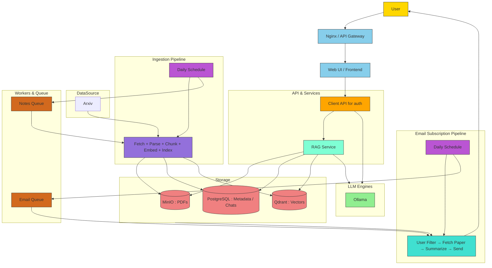

# Arxiv Knowledge Assistant (Beta)


## 🎯 Course Project

### Objective

本專案旨在建構一個 **arXiv 論文知識檢索平台**，實作完整的資料擷取、向量化檢索、LLM 問答與可視化 Dashboard。

使用者可以查詢論文摘要、PDF、問答紀錄與引用來源；開發者可設定自動擷取流程、管理向量索引、觀察模型回答效能，並可擴充至個人化 RAG 策略、服務訂閱。

---

## 🧩 Problem Statement

* 自動抓取每日 arXiv 論文：Metadata、PDF、摘要
* 支援中英文翻譯與問答
* 提供向量資料庫檢索 + LLM 問答（RAG）
* 可客製化 Prompt 與 Agent 反思深度
* Dashboard 查看歷史紀錄與統計
* 未來計畫：Email 推送、CICD、單元/整合測試

---

## 🚀 Technologies Used

| 類別                | 工具與框架                                            |
| ----------------- | ------------------------------------------------ |
| **Cloud / Infra** | Docker Compose、MinIO、PostgreSQL、Qdrant           |
| **Backend / API** | FastAPI, Celery, Prefect 2                       |
| **Frontend**      | React + Vite                                     |
| **Monitoring**    | Prometheus + Grafana, Logging                    |
| **CI/CD**         | GitHub Actions (未完成)                             |
| **Testing**       | pytest（單元 + 整合，尚未完成）                             |
| **IaC**           | Docker Compose + Volume + Network（可延伸 Terraform） |

---

## 🏗️ Project Structure

```
.
.
├── frontend/                 # React Vite app
├── data/, database/          # Database & storage initialization
├── docs/                     # 技術文件、實作歷程
├── apiGateway/                # MCP Client backend service
├── image/                    # Image-related scripts (未來擴充)
├── speech/                   # Speech service backend (未來擴充)
├── arxiv/                    # Arxiv service (Arxiv ingestion)
├── email/                    # email subscription service (email subscriptionubs)
├── note/                     # Note backend service (RAG tasks)
├── ollama_models/            # 本地 Ollama 模型管理
├── services/                 # 各微服務 Dockerfile & requirements
│   ├── arxivservice/
│   ├── emailservice/
│   ├── imageservice/
│   ├── apiGateway/
│   ├── noteservice/
│   └── speechservice/
├── terraform/                # 可選 IaC 腳本
├── docker-compose*.yml       # Docker Compose configurations
├── Dockerfile.*              # 各容器 Dockerfile
├── Makefile, setup.sh, require.txt
├── package-lock.json
├── terraform.tfstate
├── test/                     # 單元測試 & Pytest
└── README.md

```

---

## 🧪 System Workflow

1. Celery Beat 定期觸發 arXiv 擷取流程
2. PDF 與 Metadata 儲存至 MinIO / PostgreSQL
3. 文本向量化存入 Qdrant
4. LLM 問答使用 RAG + Agent 反思策略
5. 結果回傳至前端 Dashboard
6. 日後可透過 GitHub Actions 觸發 CICD / 模型更新

---

## 🖥️ System Architecture (Mermaid)



```mermaid
flowchart TB
%% ======================
%% 使用者入口
%% ======================
User[User]:::user --> Nginx[Nginx / API Gateway]:::frontend
Nginx --> Client[Web UI / Frontend]:::frontend

%% ======================
%% API & Services
%% ======================
subgraph API[API & Services]
  FastAPI[Client API for auth]:::api
  NoteServer[RAG Service]:::service
end

Client --> FastAPI
FastAPI --> NoteServer

%% ======================
%% Storage
%% ======================
subgraph Storage[Storage]
  MinIO[(MinIO : PDFs)]:::storage
  PostgreSQL[(PostgreSQL : Metadata / Chats)]:::storage
  Qdrant[(Qdrant : Vectors)]:::storage
end

NoteServer --> MinIO
NoteServer --> PostgreSQL
NoteServer --> Qdrant
FastAPI    --> LLM
NoteServer --> LLM

%% ======================
%% LLM
%% ======================
subgraph LLM[LLM Engines]
  Ollama[Ollama]:::llm
end

%% ======================
%% Ingestion Pipeline (Routine 1)
%% ======================
subgraph Ingest[Ingestion Pipeline]
  Scheduler[Daily Schedule]:::scheduler
  IngestFlow[Fetch + Parse + Chunk + Embed + Index]:::pipeline1
end

subgraph Data[DataSource]
Arxiv
end
Arxiv --> IngestFlow
Scheduler --> IngestFlow
IngestFlow --> MinIO
IngestFlow --> PostgreSQL
IngestFlow --> Qdrant

%% ======================
%% Email Subscription Pipeline (Routine 2)
%% ======================
subgraph Subscription[Email Subscription Pipeline]
  SubSched[Daily Schedule]:::scheduler
  SubFlow[User Filter → Fetch Paper → Summarize → Send]:::pipeline2
end

SubSched --> SubFlow
Storage --> SubFlow
SubFlow --> User

%% ======================
%% Workers & Queue
%% ======================
subgraph Worker[Workers & Queue]
  Queue1[Notes Queue]:::queue
  Queue2[Email Queue]:::queue
end

Scheduler --> Queue1
SubSched --> Queue2
Queue1 --> IngestFlow
Queue2 --> SubFlow

%% ======================
%% 顏色樣式
%% ======================
classDef user fill:#FFD700,stroke:#333,stroke-width:1px
classDef frontend fill:#87CEEB,stroke:#333,stroke-width:1px
classDef api fill:#FFA500,stroke:#333,stroke-width:1px
classDef service fill:#7FFFD4,stroke:#333,stroke-width:1px
classDef storage fill:#F08080,stroke:#333,stroke-width:1px
classDef pipeline1 fill:#9370DB,stroke:#333,stroke-width:1px
classDef pipeline2 fill:#40E0D0,stroke:#333,stroke-width:1px
classDef scheduler fill:#BA55D3,stroke:#333,stroke-width:1px
classDef llm fill:#90EE90,stroke:#333,stroke-width:1px
classDef queue fill:#D2691E,stroke:#333,stroke-width:1px
classDef data fill:#C0C0C0,stroke:#333,stroke-width:1px


```


---

## 🔁 Reproducibility

使用者需自行準備 **Firebase Service Account Key**：

1. 前往 [Firebase Console](https://console.firebase.google.com/) 建立專案
2. 啟用 **Authentication**（Google 登入）
3. 建立 Service Account 並下載 `serviceAccountKey.json`
4. 放置於 `apiGateway/serviceAccountKey.json` `email/serviceAccountKey.json`

> 若未提供 Key，系統將無法驗證使用者，也無法存取 Firebase 資料。

1. 前往  [App 密碼頁面](https://myaccount.google.com/apppasswords) 建立專案
2. 複製密應用程式密碼
3.

---

## 📈  Checklist

| 項目                 | 備註                                         |
| -------------------- |  ------------------------------------------ |
| Problem description  | 功能與目標明確                                    |
| Retrieval flow       |RAG + LLM 問答流程                             |
| Retrieval evaluation |  初步驗證，尚未最佳化                                 |
| LLM evaluation       |  支援多種 Prompt / Agent 深度                     |
| Interface            |  Web UI + Dashboard                         |
| Ingestion pipeline   |  Celery Beat 自動抓取 arXiv                     |
| Monitoring           |  尚未完成                    |
| Containerization     |  Docker-compose 完整管理                        |
| Reproducibility      |  完整 setup + requirements，Firebase Key 需自行提供 |
| CICD                 |  尚未完成                                       |
| Testing              |  尚未完成                                       |

---

## 📦 Installation Guide

```bash
./setup.sh

```

---

## 🔗 Useful Resources

* [Firebase Authentication](https://firebase.google.com/docs/auth)
* [Qdrant](https://qdrant.tech/documentation/)
* [Prefect 2](https://docs.prefect.io/)
* [Grafana](https://grafana.com/)

---

## 📜 License

MIT License
