明白了，你希望把 Arxiv Knowledge Assistant 的 README 改寫成這種 **課程專案 / MLOps 專案風格**，包含：

* 🎯 Course Project / Objective
* 🧩 Problem Statement
* 🚀 Technologies Used
* 🏗️ Project Structure
* 🧪 Model Lifecycle
* 🖥️ System Architecture (Mermaid)
* 📈 Evaluation Checklist
* 📦 Installation Guide
* 🔍 Dataset / 資料來源
* 🔗 Useful Resources
* 📜 License

我可以依照你的原始內容重整成這個格式，並把 Firebase Service Account、Docker Compose 視覺圖、未完成功能（CICD、test）完整呈現。

下面是一個初步潤飾版（依你的風格整理）：

---

# Arxiv Knowledge Assistant (Beta)

[English](./readme_en.md)

## 🎯 Course Project

### Objective

本專案旨在建構一個 **arXiv 論文知識檢索平台**，實作完整的資料擷取、向量化檢索、LLM 問答與可視化 Dashboard。

使用者可以查詢論文摘要、PDF、問答紀錄與引用來源；開發者可設定自動擷取流程、管理向量索引、觀察模型回答效能，並可擴充至個人化 RAG 策略。

---

## 🧩 Problem Statement

* 自動抓取每日 arXiv 論文：Metadata、PDF、摘要
* 支援中英文翻譯與問答
* 提供向量資料庫檢索 + LLM 問答（RAG）
* 可客製化 Prompt 與 Agent 反思深度
* Dashboard 查看歷史紀錄與統計
* 未來計畫：Email 推送、CICD、單元/整合測試

---

## 🚀 Technologies Used

| 類別                | 工具與框架                                            |
| ----------------- | ------------------------------------------------ |
| **Cloud / Infra** | Docker Compose、MinIO、PostgreSQL、Qdrant           |
| **Backend / API** | FastAPI, Celery, Prefect 2                       |
| **Frontend**      | React + Vite                                     |
| **Monitoring**    | Prometheus + Grafana, Logging                    |
| **CI/CD**         | GitHub Actions (未完成)                             |
| **Testing**       | pytest（單元 + 整合，尚未完成）                             |
| **IaC**           | Docker Compose + Volume + Network（可延伸 Terraform） |

---

## 🏗️ Project Structure

```
.
.
├── frontend/                 # React Vite app
├── data/, database/          # Database & storage initialization
├── docs/                     # 技術文件、實作歷程
├── mcpclient/                # MCP Client backend service
├── image/                    # Image-related scripts (未來擴充)
├── speech/                   # Speech service backend (未來擴充)
├── note/                     # Note backend service (Arxiv ingestion, RAG, tasks)
├── ollama_models/            # 本地 Ollama 模型管理
├── services/                 # 各微服務 Dockerfile & requirements
│   ├── celeryworker/
│   ├── emailservice/
│   ├── imageservice/
│   ├── mcpclient/
│   ├── noteservice/
│   └── speechservice/
├── terraform/                # 可選 IaC 腳本
├── docker-compose*.yml       # Docker Compose configurations
├── Dockerfile.*              # 各容器 Dockerfile
├── Makefile, setup.sh, require.txt
├── package-lock.json
├── terraform.tfstate
├── test/                     # 單元測試 & Pytest
├── translate.sh
└── README.md

```

---

## 🧪 System Workflow

1. Celery Beat 定期觸發 arXiv 擷取流程
2. PDF 與 Metadata 儲存至 MinIO / PostgreSQL
3. 文本向量化存入 Qdrant
4. LLM 問答使用 RAG + Agent 反思策略
5. 結果回傳至前端 Dashboard
6. 日後可透過 GitHub Actions 觸發 CICD / 模型更新

---

## 🖥️ System Architecture (Mermaid)

```mermaid
flowchart LR
    %% ===== 使用者入口 =====
    User[User]:::user --> nginx[Nginx 入口 / 反向代理]:::frontend

    %% ===== 認證與路由 =====
    nginx --> mcpclient[MCPClient Auth & Router]:::auth

    %% ===== MCPClient 分派服務 =====
    mcpclient --> noteserver[NoteServer RAG/筆記服務]:::service
    mcpclient --> ollama_dev[Ollama LLM API]:::llm
    noteserver --> |POST 請求| ollama_dev

    %% ===== Storage 模塊 =====
    subgraph Storage["Storage 模塊 (資料存取)"]
        note_db[Postgres<br/>關聯式資料庫]:::storage
        note_storage[MinIO<br/>物件存儲]:::storage
        note_qdrant[Qdrant<br/>向量資料庫]:::storage
    end

    %% Flower 與 Redis 共用
    flower[Flower<br/>任務監控 UI]:::monitor
    redis[Redis<br/>Celery 任務隊列]:::queue

    %% ===== Ingest Arxiv TaskWorker =====
    subgraph TaskWorker1["Ingest Arxiv Paper 任務隊列與後台處理"]
        worker[Worker<br/>執行 Celery 任務]:::worker
        beat[Beat<br/>定時任務發送]:::beat

        %% 任務流程
        beat -->|定時任務推送到 Redis| redis
        redis -->|Worker 從 Redis 拉取任務| worker
        worker -->|任務完成結果存入 Storage| Storage
        worker --> flower
        beat --> flower
    end

    %% ===== Email Service TaskWorker =====
    subgraph TaskWorker2["Email Service 任務隊列與後台處理"]
        worker2[Worker<br/>執行 Celery 任務]:::worker
        beat2[Beat<br/>定時任務發送]:::beat

        %% 任務流程
        beat2 -->|定時任務推送到 Redis| redis
        redis -->|Worker 從 Redis 拉取任務| worker2
        worker2 -->|任務完成結果存入 Storage| Storage
        worker2 -->|寄信給使用者| User
        worker2 --> flower
        beat2 --> flower
    end

    %% ===== 開發者專用 LLM =====
    subgraph AIAgent["開發者專用 LLM"]
        openwebui[Open-WebUI]:::frontend
        ollama_dev[Ollama]:::llm
        openwebui <--> ollama_dev
    end

    %% ===== 模塊顏色 =====
    classDef user fill:#FFD700,stroke:#333,stroke-width:1px
    classDef frontend fill:#87CEEB,stroke:#333,stroke-width:1px
    classDef auth fill:#FFA500,stroke:#333,stroke-width:1px
    classDef service fill:#7FFFD4,stroke:#333,stroke-width:1px
    classDef storage fill:#F08080,stroke:#333,stroke-width:1px
    classDef worker fill:#9370DB,stroke:#333,stroke-width:1px
    classDef beat fill:#BA55D3,stroke:#333,stroke-width:1px
    classDef queue fill:#40E0D0,stroke:#333,stroke-width:1px
    classDef monitor fill:#FFDAB9,stroke:#333,stroke-width:1px
    classDef llm fill:#90EE90,stroke:#333,stroke-width:1px

```



---

## 🔁 Reproducibility

使用者需自行準備 **Firebase Service Account Key**：

1. 前往 [Firebase Console](https://console.firebase.google.com/) 建立專案
2. 啟用 **Authentication**（Google 登入）
3. 建立 Service Account 並下載 `serviceAccountKey.json`
4. 放置於 `mcpclient/serviceAccountKey.json`

> 若未提供 Key，系統將無法驗證使用者，也無法存取 Firebase 資料。


---

## 📈  Checklist

| 項目                 | 備註                                         |
| -------------------- | | ------------------------------------------ |
| Problem description  | 功能與目標明確                                    |
| Retrieval flow       |RAG + LLM 問答流程                             |
| Retrieval evaluation |  初步驗證，尚未最佳化                                 |
| LLM evaluation       |  支援多種 Prompt / Agent 深度                     |
| Interface            |  Web UI + Dashboard                         |
| Ingestion pipeline   |  Celery Beat 自動抓取 arXiv                     |
| Monitoring           |  尚未完成                    |
| Containerization     |  Docker-compose 完整管理                        |
| Reproducibility      |  完整 setup + requirements，Firebase Key 需自行提供 |
| CICD                 |  尚未完成                                       |
| Testing              |  尚未完成                                       |

---

## 📦 Installation Guide

```bash
./setup.sh

```

---

## 🔗 Useful Resources

* [Firebase Authentication](https://firebase.google.com/docs/auth)
* [Qdrant](https://qdrant.tech/documentation/)
* [MLflow](https://mlflow.org/)
* [Prefect 2](https://docs.prefect.io/)
* [Grafana](https://grafana.com/)

---

## 📜 License

MIT License

---

如果你願意，我可以幫你再做 **更完整的 Mermaid 系統圖**，把 **arXiv ingestion → RAG → LLM → Dashboard → Email** 流程都標出，讓 CI/CD 與測試未完成部分也能視覺化。

你希望我幫你做這個圖嗎？
