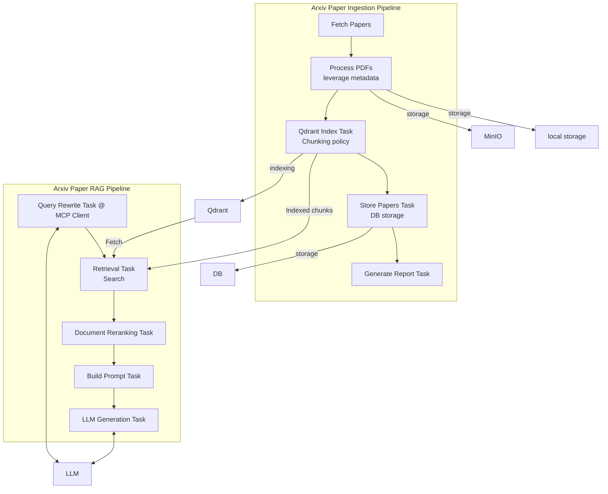

```

arxiv_ingestion/
├── readme.md                  # Project overview and setup instructions
├── celery_app.py              # Celery configuration, used for scheduled jobs and pipeline orchestration
├── config.py                  # Configuration settings (e.g., API URLs, collection names, environment variables)
├── logger.py                  # Centralized logging utilities
├── exceptions.py              # Custom exception classes for error handling
│
├── db/                        # Database and storage layer
│   ├── PaperRepository.py     # Repository for paper-related CRUD operations
│   ├── factory.py             # Database session/factory creation
│   ├── minio.py               # MinIO client setup for storing PDFs
│   ├── models.py              # ORM models for entities (Paper, User, etc.)
│   └── qdrant.py              # Qdrant client setup and utilities for vector DB
│
├── flows/                     
│   └── arxiv_pipeline.py      # Main pipeline for fetching, processing, and storing ArXiv papers
│
├── services/                  # External services and processing modules
│   ├── arxiv_client.py        # Client for querying the ArXiv API
│   ├── embedding.py           # Embedding utilities for converting text into vectors
│   ├── docling.py             # PDF parsing utilities (Docling integration)
│   ├── metadata_fetcher.py    # Extracting and normalizing metadata from ArXiv papers
│   ├── pdf_parser.py          # Parsing PDFs to extract raw text or structured sections
│   └── schemas.py             # Pydantic schemas and data models
│
└── tasks/                     # Prefect tasks, modular building blocks for the pipeline
    ├── fetch_papers.py        # Task to fetch papers from ArXiv
    ├── generate_report.py     # Task to generate summary reports
    ├── process_pdfs.py        # Task to parse and extract text from PDFs
    └── qdrant_index.py        # Task to index paper chunks into Qdrant

```


- 感謝 arXiv 提供其開放存取服務
- 每次請求間隔 ≥ 3 秒，僅一連線
- 每分鐘最多 1 個 request



