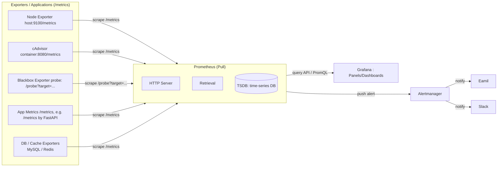

```mermaid
flowchart LR
  subgraph Exporters["Exporters / Applications (/metrics)"]
    direction TB
    A1[Node Exporter host:9100/metrics]
    A2[cAdvisor container:8080/metrics]
    A3[Blackbox Exporter probe: /probe?target=...]
    A4[App Metrics /metrics, e.g. /metrics by FastAPI]
    A5[DB / Cache Exporters\nMySQL / Redis]
  end

  subgraph P["Prometheus (Pull)"]
    direction TB
    HTTP[HTTP Server]
    Retrieval
    TSDB[(TSDB: time-series DB)]
  end


  %% Exporters -> Prometheus (pull)
  A1 -->|scrape /metrics| P
  A2 -->|scrape /metrics| P
  A3 -->|scrape /probe?target=...| P
  A4 -->|scrape /metrics| P
  A5 -->|scrape /metrics| P

  %% Prometheus internals

  P ---> |push alert| AlertM[Alertmanager]
  P -->|query API / PromQL| Grafana[Grafana : Panels/Dashboards]
  AlertM --> |notify| Eamil
  AlertM --> |notify| Slack


```
