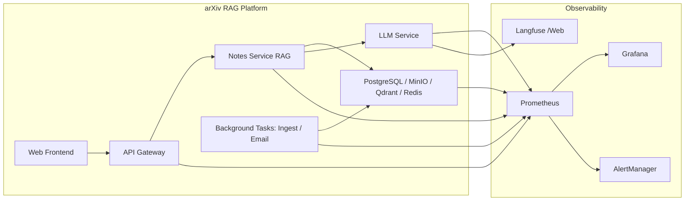

# Observability & Monitoring：以 arXiv 驅動的個人化 RAG 平台為例

> 作者：小安｜日期：2025-09-05
> 針對後端、MLOps、DevOps 的 Observability 實務分享

---

## 1. 前言：為什麼 Observability / Monitoring 很重要

在現代複雜系統中，僅靠日誌或單一指標很難掌握系統健康狀態。對於我們的專案——一個結合 **arXiv Ingestion Pipeline、RAG Chat Engine、Email 訂閱服務** 的個人化資訊平台，系統包含多個微服務、共享資料庫、向量資料庫以及背景任務。

面對這樣的架構，我們需要：

* **Monitoring（監控）**：追蹤已知指標，設告警門檻，確保服務運行健康
* **Observability（可觀測性）**：分析未知異常，定位性能瓶頸與流程問題

換句話說，我們要：

* 確保 **服務可用性**（API、Notes Service、背景任務）
* 監控 **性能瓶頸**（（Prefect Flow / Task 延遲、LLM 調用延遲）
* 快速 **定位異常**（API 過頻、Redis/DB 錯誤、資源耗盡）

---

## 2. Observability 核心概念

我們將觀測重點分為三大類：Metrics、Tracing、Alert / Logging。

| 類別              | Monitoring（監控）                                   | Observability（可觀測性）                            |
| --------------- | ------------------------------------------------ | ---------------------------------------------- |
| **Metrics**     | CPU/Memory/Disk、API 請求數、Celery 成功率、Redis/DB 操作次數 | LLM 延遲、Celery 任務詳細耗時、Redis/DB latency、API 路由細節 |
| **Tracing**     |                      -                  | RAG 問答流程全程追蹤、Prefect Flow / Task 流程分析             |
| **Alert / Log** | 服務不可用、API 過頻、資源異常告警                              | 日誌與異常追蹤、定位未知問題                                 |

> 簡單來說，Metrics 量化、Tracing 跟蹤流程、Alert / Log 告訴你系統哪裡出問題。

---

## 3. 專案實作經驗

### 3.1 工具選型

* **Prometheus**：收集系統與應用 Metrics
* **Grafana**：可視化 Metrics 與 Tracing 結果
* **AlertManager**：設定告警規則，發送通知（Slack / PagerDuty / Email）
* **Langfuse（選配）**：LLM 調用觀測

### 3.2 Metrics 收集策略

* **Celery 任務**：成功率、延遲、重試次數、失敗率
* **API 路由**：請求次數（Counter）、延遲時間（Histogram）
* **Redis / DB**：GET/SET 次數、查詢延遲、錯誤率
* **LLM 調用**：延遲、成功率、異常次數（可用 Langfuse 擴充細節觀測）

### 3.3 Tracing 策略

* RAG 問答流程全程追蹤，從 Query Rewrite → Hybrid Search → Rerank → Prompt 組裝 → LLM 回覆
* Background Tasks（Ingest / Email / Notes Service）流程追蹤，方便分析瓶頸

### 3.4 Alert / Log 設計

* **服務可用性**：Instance down、Network unreachable
* **資源異常**：CPU、Memory、Disk 空間使用率
* **API 過頻 / 異常行為**：單個 endpoint 請求速率過高、返回錯誤率過高
* 所有告警透過 **AlertManager** 發送通知

---

## 4. Observability 架構圖示意

> 上圖示意整個平台與 Observability 架構關係，Metrics / Tracing 由 Prometheus 收集，Grafana 可視化，AlertManager 負責告警。

---

## 5. 實務心得

1. **程式內 Metrics 裝飾器很重要**：decorator 可捕捉每個 FastAPI 路由、Redis、DB 調用。
2. **Tracing 幫助定位瓶頸**：RAG 問答流程複雜，多個步驟，Tracing 能精確指出延遲來源（如 reranker 或 LLM 調用）。
3. **Alert 規則需合理**：過於敏感會造成告警疲勞，過於寬鬆又可能延誤問題。設定 threshold 要結合實際系統負載。

---

## 6. 小結

在複雜的個人化 RAG 平台中，Observability / Monitoring 不僅是運維工具，更是**開發與性能優化的重要依據**。
透過 **Metrics、Tracing、Alert/Logging** 組合，以及 **程式內自動收集與 Prometheus / Grafana / AlertManager** 的整合，我們可以：

* 快速掌握系統健康狀態
* 精準定位性能瓶頸與錯誤
* 提升服務穩定性與用戶體驗
> Langfuse 提供 LLM 層的可選觀測，方便 RAG 調優與細節追蹤。

---

✅ **重點提醒**：

* Metrics：量化指標、成功率與延遲
* Tracing：流程追蹤、瓶頸定位
* Alert / Log：即時告警、異常通知

---
