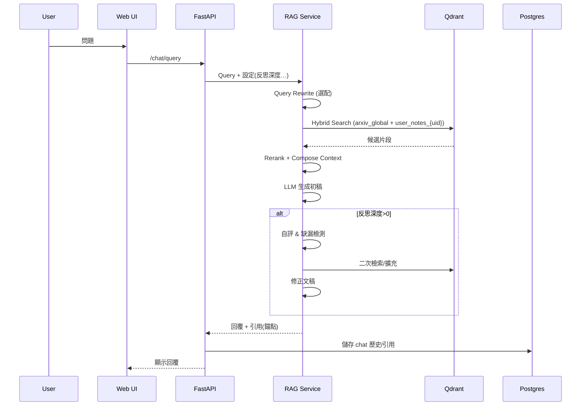

# 新版需求說明書：arXiv 驅動的個人化 RAG 平台（含 Agentic RAG 與訂閱摘要）

> 版本：v0.1（草案）｜撰寫日期：2025-08-20｜目標讀者：產品、架構、後端、前端、MLOps

---

## 0. 執行摘要（Overview）

本專案聚焦「論文為主」的個人化檢索與筆記平台：

1. **每日定時擷取 arXiv**（抓取中英文摘要、PDF、Metadata），寫入 **PostgreSQL + MinIO + Qdrant**；
2. 提供 **登入後的論文檢索與問答聊天介面**（含 Chat 歷史、可點擊引用來源）；
3. 針對 **訂閱用戶（Email）** 每日寄送 **主題化論文總結**（採 GraphRAG 強化聚合與脈絡）；
4. **個人筆記** 與 **個人向量資料庫隔離**；
5. **高級設定**（自動翻譯、客製 Prompt、Agent 反思深度）。

MVP 以 **穩定資料管線、清楚檢索體驗與可信賴引用** 為優先；進階階段逐步引入 GraphRAG、主題訂閱、與更細緻的多租戶治理。

---

## 1. 目標與非目標

### 1.1 目標

* 每日自動 ingest arXiv（含增量）→ 可查詢、可追溯來源。
* 登入後的論文檢索聊天體驗（RAG + 引用）。
* 訂閱者每日收到個人化主題摘要 Email（GraphRAG 聚合）。
* 使用者私有筆記上傳／撰寫、索引與檢索（與公共論文庫分離）。
* 高級設定：翻譯、Prompt 模板、Agent 反思深度（Multi-step）。

### 1.2 非目標（首版不做）

* 共同編輯／多人筆記協作。
* 跨平台（行動 App）離線支援。
* 高風險自動代理執行（如自動網爬與外部寫入）。

---

## 2. 使用者類型與權限

* **一般使用者（User）**：登入、檢索、聊天、管理個人筆記、訂閱與設定。
* **管理者（Admin）**：數據管線監控、重跑、黑名單、佇列觀測（Flower / Prefect UI）、郵件退信與速率管理、索引重建。

---

## 3. 功能需求（FRD）

### 3.1 每日 arXiv Ingestion

* 支援依 **主題類別、關鍵字、日期** 的增量抓取。
* 抓取欄位：arxiv\_id、標題、作者、摘要、分類、發佈日期、PDF 連結、License、DOI（如有）。
* PDF 下載至 **MinIO**（以 `bucket/arxiv/{y}/{m}/{arxiv_id}.pdf` 命名）。
* 內容處理：

  * PDF → 文字抽取（保留頁碼與段落位移）；
  * 可選擇 **英文→中文** 翻譯（記錄語言標記 `lang`）；
  * Chunking（可配置 policy：長度、重疊、依段落/章節）；
  * Embedding（記錄 `model_name`、`dim`、`version`）。
* 寫入：

  * **PostgreSQL**：論文與 chunk metadata；
  * **Qdrant**：向量（collection: `arxiv_global_v1`）；payload 帶 `paper_id, chunk_id, page, section, lang, hash`；
  * **MinIO**：原始 PDF 與可選 TXT。
* 去重：以 `arxiv_id` + 內容 checksum；
* 可重跑：以 `ingest_job_id` 追蹤與冪等。

### 3.2 檢索與問答（RAG Chat）

* 登入後：

  * **Query Rewrite**（選配）；
  * **Hybrid Search**（向量 + 關鍵詞 BM25，預留 reranker）；
  * **來源引用**：顯示標題、作者、年份、頁碼/段落錨點；
  * **Chat 歷史**（可重載上下文、標記最愛、匯出）；
  * **Groundedness 提示**：顯示每段引用分數／置信度。
* 個人筆記也進入檢索（同時檢索 `arxiv_global` + `user_notes_{uid}`，或使用 tenant 過濾）。

### 3.3 訂閱與每日 Email 總結（GraphRAG）

* 使用者在「訂閱中心」設定：主題、分類、關鍵字、頻率（每日）。
* 每日產生：

  * **主題圖譜**（GraphRAG）：抽取**實體**（作者、主題、方法、資料集）與**關係**（引用、共現）；
  * 依社群/主題聚合**Top-N** 論文，生成**群落摘要**與**重點對照表**；
  * 寄送 HTML Email（含「閱讀更多」連結與保存到個人筆記的 CTA）。
* 郵件退信、開啟率、點擊率追蹤（Postgres 記錄）。

### 3.4 個人筆記

* 富文字/Markdown 編輯、上傳（md/txt/pdf）與標籤。
* 私有索引（Qdrant collection：`user_{uid}_notes_v1` 或以 `tenant_id` 過濾）。
* 連結到論文（`note_links.paper_id`）。
* 可在 Chat 引用個人筆記片段。

### 3.5 高級設定

* **翻譯**：預設英文→中文（可關閉）。
* **自訂 Prompt**：系統提示模板可覆蓋（安全白名單變數）。
* **Agent 反思深度**：0（傳統 RAG）、1-3（多步檢索與自評）。
* **檢索參數**：Top-K、最長輸入長度、重排器開關。

---

## 4. 非功能性需求（NFR）

* **可靠性**：Ingestion 重試、任務冪等、部分失敗可恢復。
* **可觀測**：Metrics（Prometheus）/ Tracing（OTel）/ LLM 事件（Langfuse）。
* **安全**：OAuth（Google）登入、JWT、RBAC；資料分層與租戶隔離；GDPR 刪除。
* **成本控制**：快取、最小化上下文、批次 Embedding、離線摘要。
* **效能**：查詢 P95 < 1.5s（Top-K 8、含 rerank 開關）。

---

## 5. 系統架構（高階）

```
[Web/SPA] ──> [API Gateway (FastAPI)] ──> [Service Layer]
                         │                     ├─ Auth (OAuth/JWT)
                         │                     ├─ Papers Service (CRUD/Search)
                         │                     ├─ RAG Service (Retriever/Ranker/LLM)
                         │                     ├─ Notes Service
                         │                     └─ Subscription/Email Service
                         │
                         ├─ PostgreSQL (metadata, chats, users, jobs)
                         ├─ MinIO (pdf, text artifacts)
                         ├─ Qdrant (vectors: arxiv_global, user_notes_*)
                         ├─ Redis (queue/cache)
                         └─ Celery + Beat / Prefect (ingest & email schedules)
```

### 5.1 流程圖（Mermaid）

#### a) 每日 Ingest Pipeline

```mermaid
flowchart LR
  S[Scheduler (Beat/Prefect)] --> J{拉取 arXiv 清單}
  J --> D[下載 PDF]
  D --> E[抽取文字/頁碼]
  E --> T[可選 翻譯 EN->ZH]
  T --> C[Chunking]
  C --> V[Embedding]
  V -->|payload| Q[(Qdrant: arxiv_global_v1)]
  C --> P[(PostgreSQL: papers, chunks)]
  D --> M[(MinIO: pdf)]
  J --> L[(Jobs/Logs)]
```

#### b) RAG Chat（Agentic）



#### c) 訂閱 Email（GraphRAG）

```mermaid
flowchart LR
  S[每日排程] --> F[篩選用戶訂閱主題]
  F --> G[抽取關聯圖(實體/關係)]
  G --> H[社群偵測/主題聚合]
  H --> R[生成每群落摘要]
  R --> E[渲染 HTML Email]
  E --> M[寄送]
  M --> L[寫回成效(開信/點擊/退信)]
```

---

## 6. 資料模型（初稿）

### 6.1 PostgreSQL（主表）

* `users(id, email, name, auth_provider, role, created_at)`
* `profiles(user_id, locale, timezone, prefs_json)`
* `subscriptions(id, user_id, topics[], categories[], keywords[], freq, active, created_at)`
* `papers(id, arxiv_id, title, authors, categories[], published_at, doi, pdf_key, lang, hash, created_at)`
* `paper_chunks(id, paper_id, order, page_from, page_to, section, text_hash, lang)`
* `notes(id, user_id, title, md, tags[], created_at, updated_at)`
* `note_chunks(id, note_id, order, section, lang)`
* `chat_sessions(id, user_id, title, settings_json, created_at)`
* `chat_messages(id, session_id, role, content, metadata_json, created_at)`
* `citations(id, message_id, source_type, source_id, chunk_id, score, page_from, page_to)`
* `jobs(id, type, status, params_json, started_at, finished_at, error)`
* `email_batches(id, run_date, status, stats_json)`
* `email_events(id, batch_id, user_id, type, ts)`

### 6.2 Qdrant Collections（建議）

* `arxiv_global_v1`：payload `{paper_id, chunk_id, page, section, lang, hash}`
* `user_{uid}_notes_v1` 或 `notes_v1` + payload `{user_id, note_id, chunk_id, lang}`（二選一：**獨立 collection** vs **共享+tenant 過濾**）。

### 6.3 MinIO

* `arxiv/{yyyy}/{mm}/{arxiv_id}.pdf`
* `artifacts/{paper_id}/text.txt`（選配）

---

## 7. API 草案（主要）

* `POST /auth/login`（OAuth callback）
* `GET /papers/search?q=&cats=&from=&to=&page=`
* `GET /papers/{paper_id}`（含引用資訊）
* `POST /chat/sessions` / `GET /chat/sessions`
* `POST /chat/query {session_id?, query, settings_override}` → 回覆含 `citations[]`
* `POST /notes` / `GET /notes` / `PUT /notes/{id}` / `DELETE /notes/{id}`
* `POST /subscriptions` / `GET /subscriptions`
* `POST /settings`（翻譯/Prompt/反思深度/檢索參數）
* Admin：`POST /ingest/run`、`GET /ingest/jobs`、`POST /index/rebuild`

---

## 8. 關鍵技術選型

* **後端**：FastAPI（pydantic v2）、SQLAlchemy、Alembic。
* **任務/排程**：Celery + Redis + Beat（或 Prefect 替代）。
* **搜尋**：Qdrant（HNSW、payload filter）、可選 BM25（Postgres/PGroonga/Meilisearch）。
* **儲存**：PostgreSQL、MinIO（S3 相容）。
* **LLM/RAG**：LangChain/LlamaIndex 或自研，支援 reranker、Query Rewrite、Agent 反思。
* **GraphRAG**：NER/關係抽取→知識圖譜（NetworkX/Neo4j 選配）→社群摘要。
* **前端**：React/Next.js、shadcn/ui、Tailwind、Framer Motion。
* **身分**：Google OAuth（Authlib / Firebase Auth）。
* **Email**：Postmark/SendGrid（Webhook 回寫事件）。
* **可觀測**：Prometheus、Grafana、OpenTelemetry、Langfuse。

---

## 9. 租戶與資料隔離策略

* **arXiv 全局庫**共用（只讀）。
* **個人筆記**：

  * 選項A：每用戶一個 Qdrant collection（隔離強，量多管理成本高）。
  * 選項B：單 collection + `user_id` 過濾（維運簡化，查詢需嚴格 filter）。
* PostgreSQL 層面：所有筆記與聊天記錄必須帶 `user_id` 外鍵與索引；刪除遵循 GDPR（硬刪/延遲刪）。

---

## 10. 安全與合規

* OAuth + JWT（短存活存取權杖 + 旋轉 refresh）。
* RBAC：`user/admin` + route-level guard。
* Rate Limit：IP + user 綜合（反濫用）。
* 敏感設定（Prompt 模板）server-side 加密保存；審計變更。
* PDF 下載與存取簽名 URL；MinIO Bucket Policy least-privilege。

---

## 11. 可觀測性與營運

* **Metrics**：

  * Ingest：成功/失敗、吞吐、延遲、去重率。
  * Chat：查詢時延、Top-K 命中、rerank 命中率、引用覆蓋率。
  * Email：開啟率、點擊率、退信率。
* **Tracing**：單次問答的檢索步驟、LLM 調用、反思循環次數。
* **Log/Alert**：任務失敗、Qdrant 不可用、MinIO 空間、Email 配額。

---

## 12. MVP → 里程規劃

* **Phase 1：Ingest 基礎 (1-2 週)**

  * arXiv 拉取 + PDF 下載 + 文字抽取 + Chunk + Embedding
  * PostgreSQL / Qdrant / MinIO 結構與索引
  * Celery Beat 定時與重試、去重
* **Phase 2：RAG Chat 與引用 (1-2 週)**

  * 前端聊天介面、歷史保存、引用卡片
  * Hybrid 檢索 + Rerank（開關）
  * 高級設定（反思深度、翻譯）
* **Phase 3：訂閱 Email（GraphRAG）(1-2 週)**

  * 訂閱管理、主題聚合、HTML 模板、寄送與事件回寫
* **Phase 4：個人筆記 (1 週)**

  * 筆記 CRUD、索引、與 Chat 整合
* **Phase 5：營運化 (1 週)**

  * 可觀測、Admin 控制台、備份與 SLO

---

## 13. 風險與緩解

* **PDF 解析品質**：多引擎備援（pdfminer/pymupdf），保留頁碼錨點；
* **Embedding 成本**：批次化、去重、向量壓縮（可選 FAISS 壓縮或多段式檢索）；
* **GraphRAG 效能**：先以抽取/共現簡化圖譜，控制節點規模，異步離線生成；
* **多租戶洩露風險**：端到端加測（payload filter、SQL Row Level Security 選配）。

---

## 14. 驗收準則（Acceptance）

* Ingest 任務每日 00:30 UTC 觸發，P95 完成於 1 小時內，重試 3 次冪等。
* Chat 回覆含**至少 2 條可點擊引用**，能定位到段落/頁碼。
* 訂閱者每日 08:00 本地時區收到 Email；Email 至少含 3 篇新論文、1 段主題摘要、1 張要點清單。
* 個人筆記可被檢索並出現在引用清單中（標識 note）。
* 高級設定生效且可由訊息 metadata 追溯。

---

## 15. 介面草圖與交互（簡述）

* **首頁/搜尋**：關鍵字、分類篩選、結果卡片（標題、作者、年份、標籤、加入筆記/收藏）。
* **Chat**：左側歷史列表；主視窗訊息氣泡；右側「引用與來源」抽屜；頂部「高級設定」。
* **筆記**：列表、標籤、編輯器（Markdown）；連結到論文；一鍵重新索引。
* **訂閱中心**：主題與關鍵字；預覽本日樣本 Email。
* **Admin**：排程/任務、指標、重建索引、一鍵重跑。

---

## 16. 實作備忘（技術要點）

* **Chunking Policy**：`by_section | by_tokens | sliding_window`（優先 by\_section，退回 sliding）。
* **Hybrid 檢索**：`Qdrant ANN` + `BM25`（可用 Postgres + pg\_trgm / Meilisearch）。
* **Reranker**：Cross-Encoder（可選開關）。
* **Agent 反思**：`self-eval -> gap-detect -> targeted-retrieve -> refine`（最多 2 輪）。
* **引用對齊**：保留 `page/section/span_offset`，UI 折疊顯示。
* **Email 模板**：MJML/HTMl；行動端優化；UTM 加註。
* **多語**：儲存原文與譯文（`lang_src`, `lang_out`）。

---

## 17. 後續工作（Next）

* 產出：ERD、OpenAPI 3.1 規格、`docker-compose` 與 `.env.sample`、Ingest 任務雛形（Celery/Prefect 二擇一）。
* 決策：Qdrant 策略（獨立 collection vs 共享 + tenant filter）、BM25 引擎、LLM/Embedding 型號與供應商。
* POC 驗證：

  1. 以 1,000 篇 arXiv（cs.CL/cs.LG）建立索引；
  2. 10 條查詢集做檢索評估（nDCG\@10 / Recall\@20 / Quote 覆蓋率）。
