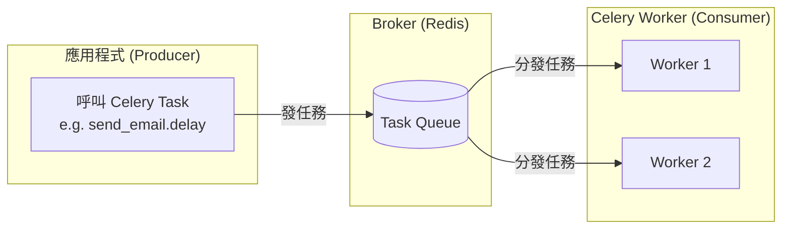
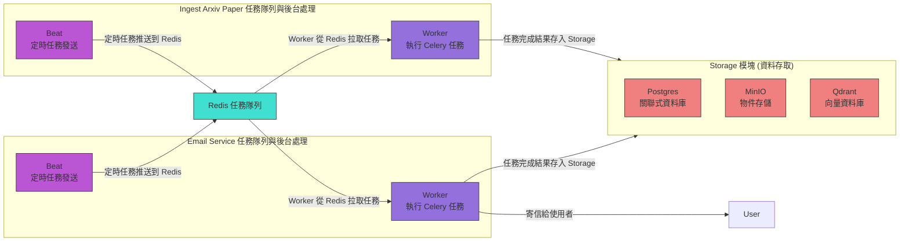

---

## **訊息任務處理生態系**

---

## 整體脈絡

* **核心問題**：如何把「要做的工作（任務）」從**產生方**（Producer）送給**處理方**（Consumer/Worker），並且在過程中能排程、重試、分散處理。
* **解決方式**：透過 **Broker**（訊息中介系統）來解耦生產與消費。

---

## 名詞區分

### 1. Celery

* **定位**：一個 Python 的分散式任務隊列框架。
* **功能**：

  * 定義任務（tasks）
  * 排程（beat）
  * 執行（worker）
  * 支援 Broker（如 Redis、RabbitMQ、Kafka）
* **你可以把它當成「任務管理員」**。

---

### 2. Broker

* **定位**：負責「訊息傳遞」的中介（像郵局）。
* **例子**：

  * Redis
  * RabbitMQ
  * Kafka
* **Celery 本身不處理訊息傳送，它一定需要一個 broker。**

---

### 3. Beat

* **定位**：Celery 內建的**排程器**。
* **用途**：像 cron job，一段時間送一次任務到 Broker，然後 Worker 執行。
* **例子**：

  * 每天 8 點寄 email 報表 → beat 發出「寄信任務」 → broker → worker 執行。

---

### 4. Worker

* **定位**：真正執行任務的工人程式。
* **功能**：從 broker 拿到任務 → 執行 → 回傳結果（可存到 backend）。

---

### 5. Producer

* **定位**：產生任務的人（程式）。
* **功能**：呼叫 Celery task → 寫入 broker → 等 worker 執行。
* **例子**：

  * Web API 收到「寄信請求」 → 呼叫 `task.send_email.delay(...)` → Celery 把任務丟給 broker。

---

### 6. Consumer

* **定位**：任務的消費者。
* **在 Celery 裡就是 worker**。
* **Worker = Consumer**。

---

### 7. Kafka

* **定位**：一個高效能、分散式的訊息隊列系統（broker 的一種）。
* **差異**：

  * RabbitMQ / Redis：比較適合任務佇列（queue）模式。
  * Kafka：偏向事件流（event streaming），可以讓很多 consumer 同時訂閱，不會只被「一個工人」拿走。

---

## 串起來的例子

1. **Producer**：Web API → 發出「寄信任務」
2. **Broker**：Redis / RabbitMQ / Kafka → 暫存任務
3. **Beat**（可選）：如果是排程任務，由它產生 → 丟給 broker
4. **Worker/Consumer**：Celery worker → 從 broker 拿任務 → 執行 → 存結果

---

👉 簡單比喻：

* **Producer**：寄件人
* **Broker**：郵局（信件分發）
* **Consumer/Worker**：收件人（工人去做事）
* **Beat**：定時寄信人
* **Celery**：一個整合寄件、排程、收件的「任務郵務系統」
* **Kafka**：一種超強郵局，信可以被很多人抄送。

