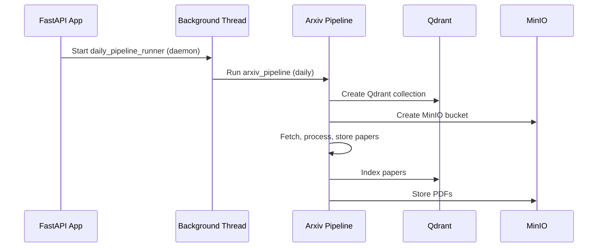

```
classDiagram
    class PDFParserService {
        - cache_dir: Path
        - image_dir: Path
        + parse_pdf(pdf_path: Path): Optional[PdfContent]
        + _parse_pdf_sync(pdf_path: Path): Optional[PdfContent]
    }
    class TextExtractor {
        + extract(pdf_path: Path): (List[PaperSection], List[str])
        + extract_stream(pdf_stream: io.BytesIO): (List[PaperSection], List[str])
    }
    class TableExtractor {
        + extract(pdf_path: Path, pdf_filename: str): List[PaperTable]
    }
    class FigureExtractor {
        - image_dir: Path
        + extract(pdf_path: Path, pdf_filename: str): List[PaperFigure]
    }
    PDFParserService --> TextExtractor
    PDFParserService --> TableExtractor
    PDFParserService --> FigureExtractor

```