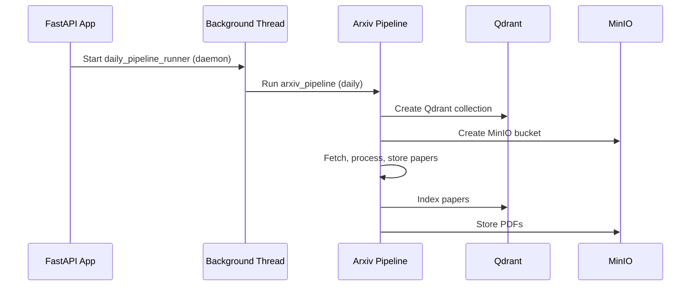

```mermaid
sequenceDiagram
    participant API as FastAPI App
    participant Thread as Background Thread
    participant Pipeline as Arxiv Pipeline
    API->>Thread: Start daily_pipeline_runner (daemon)
    Thread->>Pipeline: Run arxiv_pipeline (daily)
    Pipeline->>Qdrant: Create Qdrant collection
    Pipeline->>MinIO: Create MinIO bucket
    Pipeline->>Pipeline: Fetch, process, store papers
    Pipeline->>Qdrant: Index papers
    Pipeline->>MinIO: Store PDFs

```