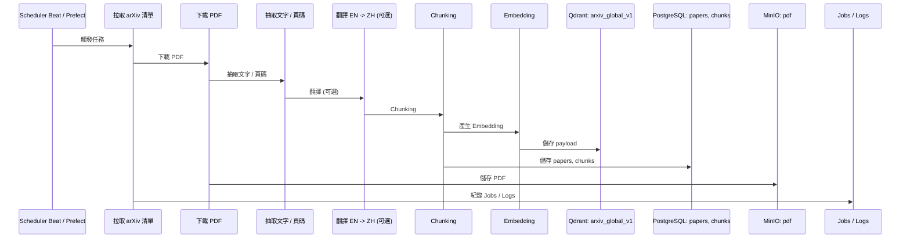
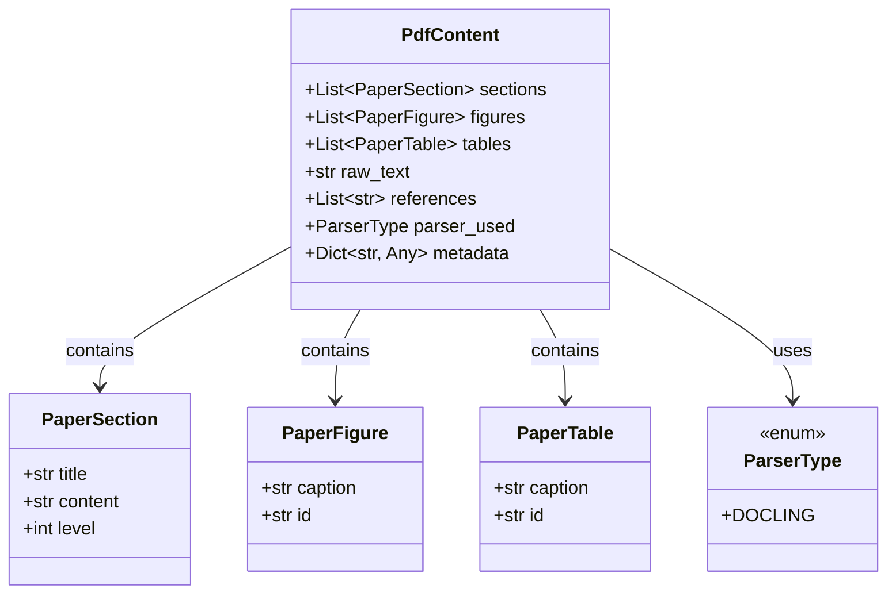
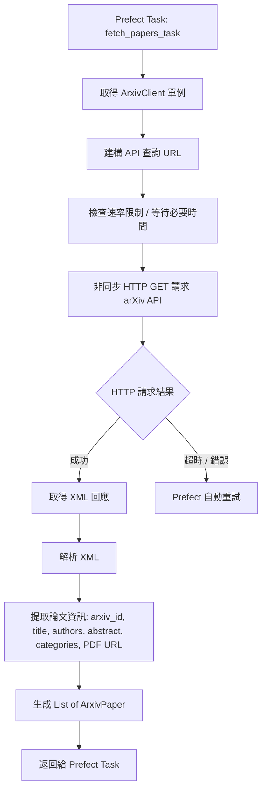

```mermaid
sequenceDiagram
    participant S as Scheduler Beat / Prefect
    participant J as 拉取 arXiv 清單
    participant D as 下載 PDF
    participant E as 抽取文字 / 頁碼
    participant T as 翻譯 EN -> ZH (可選)
    participant C as Chunking
    participant V as Embedding
    participant Q as Qdrant: arxiv_global_v1
    participant P as PostgreSQL: papers, chunks
    participant M as MinIO: pdf
    participant L as Jobs / Logs

    S ->> J: 觸發任務
    J ->> D: 下載 PDF
    D ->> E: 抽取文字 / 頁碼
    E ->> T: 翻譯 (可選)
    T ->> C: Chunking
    C ->> V: 產生 Embedding
    V ->> Q: 儲存 payload
    C ->> P: 儲存 papers, chunks
    D ->> M: 儲存 PDF
    J ->> L: 紀錄 Jobs / Logs


```

```mermaid
classDiagram
    class PDFParserService {
        - cache_dir: Path
        - image_dir: Path
        + parse_pdf(arxiv_id: str, save_img_local: bool): Optional[PdfContent]
        + _parse_pdf_sync(arxiv_id: str, save_img_local: bool): Optional[PdfContent]
    }
    class TextExtractor {
        + extract_stream(pdf_stream: io.BytesIO): (List[PaperSection], List[str])
    }
    class TableExtractor {
        + extract_stream(pdf_stream: io.BytesIO): (List[PaperTable])
    }
    class FigureExtractor {
        - image_dir: Path
        + extract_stream(pdf_stream: io.BytesIO): (List[PaperFigure])
    }
    PDFParserService --> TextExtractor
    PDFParserService --> TableExtractor
    PDFParserService --> FigureExtractor

```

```mermaid
classDiagram
    class PdfContent {
        +List~PaperSection~ sections
        +List~PaperFigure~ figures
        +List~PaperTable~ tables
        +str raw_text
        +List~str~ references
        +ParserType parser_used
        +Dict~str, Any~ metadata
    }

    class PaperSection {
        +str title
        +str content
        +int level
    }

    class PaperFigure {
        +str caption
        +str id
    }

    class PaperTable {
        +str caption
        +str id
    }

    class ParserType {
        <<enum>>
        +DOCLING
    }

    PdfContent --> PaperSection : contains
    PdfContent --> PaperFigure : contains
    PdfContent --> PaperTable : contains
    PdfContent --> ParserType : uses

```

```mermaid
flowchart TD
    A[Prefect Task: fetch_papers_task] --> B[取得 ArxivClient 單例]
    B --> C[建構 API 查詢 URL]
    C --> D[檢查速率限制 / 等待必要時間]
    D --> E[非同步 HTTP GET 請求 arXiv API]
    E --> F{HTTP 請求結果}
    F -->|成功| G[取得 XML 回應]
    F -->|超時 / 錯誤| H[Prefect 自動重試]
    G --> I[解析 XML]
    I --> J[提取論文資訊: arxiv_id, title, authors, abstract, categories, PDF URL]
    J --> K[生成 List of ArxivPaper]
    K --> L[返回給 Prefect Task]

```
