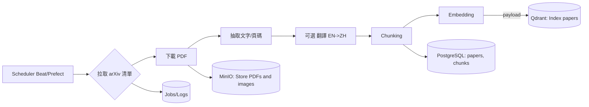
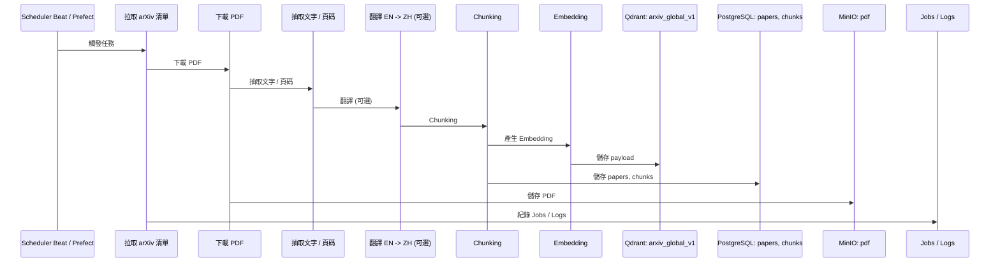
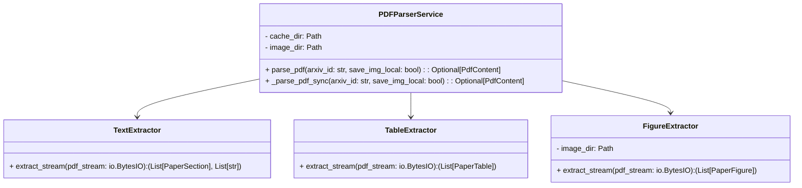

```mermaid
flowchart LR
  S[Scheduler Beat/Prefect] --> J{拉取 arXiv 清單}
  J --> D[下載 PDF]
  D --> E[抽取文字/頁碼]
  E --> T[可選 翻譯 EN->ZH]
  T --> C[Chunking]
  C --> V[Embedding]
  V -->|payload| Q[(Qdrant: Index papers)]
  C --> P[(PostgreSQL: papers, chunks)]
  D --> M[(MinIO: Store PDFs and images)]
  J --> L[(Jobs/Logs)]

```

```mermaid
sequenceDiagram
    participant S as Scheduler Beat / Prefect
    participant J as 拉取 arXiv 清單
    participant D as 下載 PDF
    participant E as 抽取文字 / 頁碼
    participant T as 翻譯 EN -> ZH (可選)
    participant C as Chunking
    participant V as Embedding
    participant Q as Qdrant: arxiv_global_v1
    participant P as PostgreSQL: papers, chunks
    participant M as MinIO: pdf
    participant L as Jobs / Logs

    S ->> J: 觸發任務
    J ->> D: 下載 PDF
    D ->> E: 抽取文字 / 頁碼
    E ->> T: 翻譯 (可選)
    T ->> C: Chunking
    C ->> V: 產生 Embedding
    V ->> Q: 儲存 payload
    C ->> P: 儲存 papers, chunks
    D ->> M: 儲存 PDF
    J ->> L: 紀錄 Jobs / Logs


```

```mermaid
classDiagram
    class PDFParserService {
        - cache_dir: Path
        - image_dir: Path
        + parse_pdf(arxiv_id: str, save_img_local: bool): Optional[PdfContent]
        + _parse_pdf_sync(arxiv_id: str, save_img_local: bool): Optional[PdfContent]
    }
    class TextExtractor {
        + extract_stream(pdf_stream: io.BytesIO): (List[PaperSection], List[str])
    }
    class TableExtractor {
        + extract_stream(pdf_stream: io.BytesIO): (List[PaperTable])
    }
    class FigureExtractor {
        - image_dir: Path
        + extract_stream(pdf_stream: io.BytesIO): (List[PaperFigure])
    }
    PDFParserService --> TextExtractor
    PDFParserService --> TableExtractor
    PDFParserService --> FigureExtractor

```
