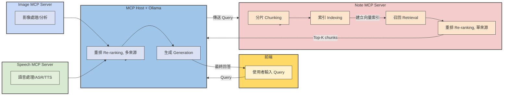

```
llm-mcp-assistant/
├── app/
│   ├── main.py              # FastAPI server
│   ├── agents/               # 所有 Agent 模組
│   │   ├── analytics_agent.py
│   │   ├── knowledge_retriever.py
│   │   ├── multimodal_assistant.py
│   │   ├── reasoning_agent.py
│   │   └── speech_tools.py
│   │   └── vision_tools.py
│   ├── tools/              # MCP 工具函式
│   ├── config.py
│   └── llm_client.py       # Gemini / OpenRouter API Wrapper
├── data/                   # MCP 說明文檔、向量化資料
├── frontend/               # Streamlit UI (optional)
├── docker-compose.yml
├── requirements.txt
└── README.md
```


- Agendic RAG
- reAct
- self-RAG


