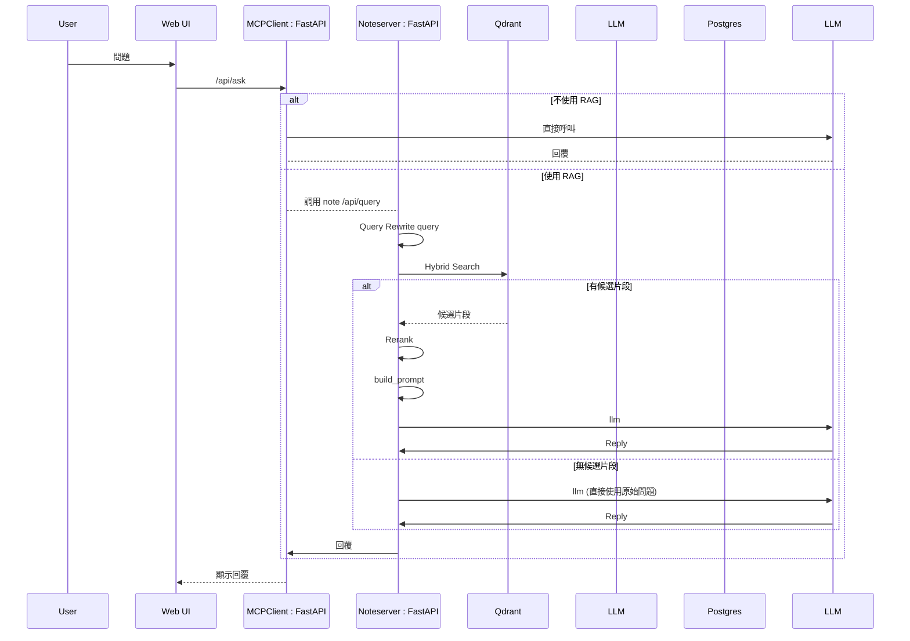

```mermaid
sequenceDiagram
  participant U as User
  participant FE as Web UI
  participant API as MCPClient : FastAPI
  participant R as Noteserver : FastAPI
  participant Q as Qdrant
  participant L as LLM
  participant DB as Postgres
  U->>FE: 問題
  FE->>API: /api/ask
  alt 不使用 RAG
    API->>LLM: 直接呼叫
    LLM-->API: 回覆
  else 使用 RAG
    API --> R: 調用 note /api/query
    R->>R:  Query Rewrite query
    R->>Q: Hybrid Search
    alt 有候選片段
      Q-->>R: 候選片段
      R->>R: Rerank
      R->>R: build_prompt
      R->>LLM: llm
      LLM->>R: Reply
    else 無候選片段
      R->>LLM: llm (直接使用原始問題)
      LLM->>R: Reply
    end
    R->>API: 回覆
  end
  API-->>FE: 顯示回覆
```
