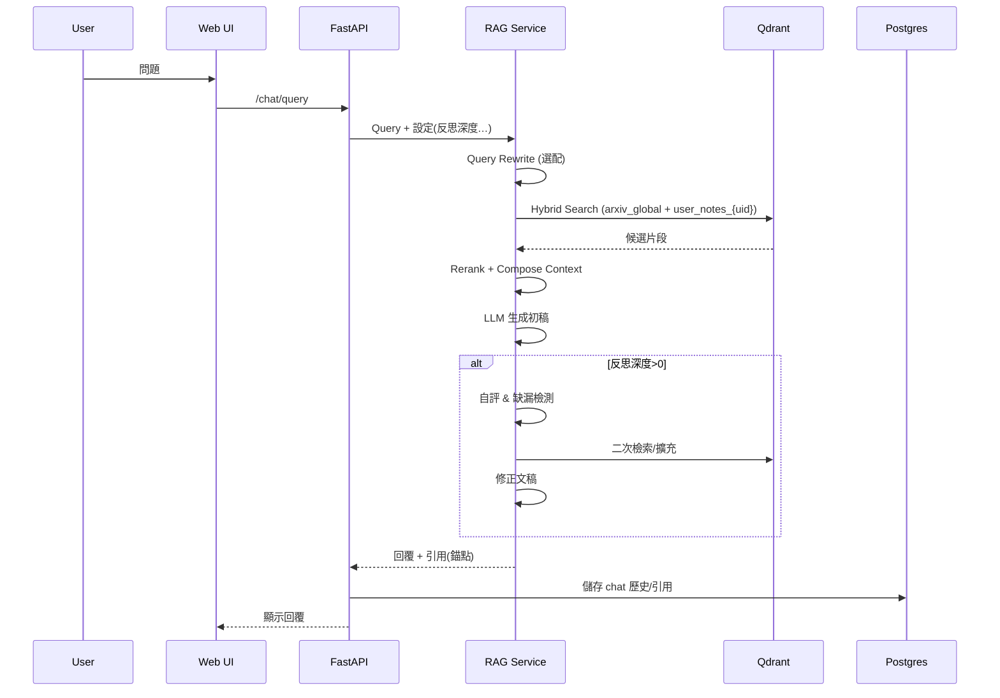

```mermaid
sequenceDiagram
  participant U as User
  participant FE as Web UI
  participant API as FastAPI
  participant R as RAG Service
  participant Q as Qdrant
  participant DB as Postgres
  U->>FE: 問題
  FE->>API: /chat/query
  API->>R: Query + 設定(反思深度…)
  R->>R: Query Rewrite (選配)
  R->>Q: Hybrid Search (arxiv_global + user_notes_{uid})
  Q-->>R: 候選片段
  R->>R: Rerank + Compose Context
  R->>R: LLM 生成初稿
  alt 反思深度>0
    R->>R: 自評 & 缺漏檢測
    R->>Q: 二次檢索/擴充
    R->>R: 修正文稿
  end
  R-->>API: 回覆 + 引用(錨點)
  API->>DB: 儲存 chat 歷史/引用
  API-->>FE: 顯示回覆
```
