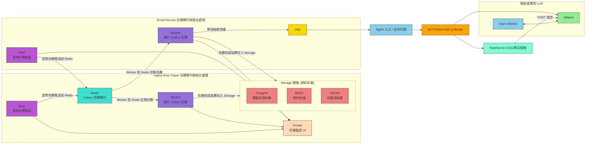

```mermaid
flowchart LR
    %% ===== 使用者入口 =====
    User[User]:::user --> nginx[Nginx 入口 / 反向代理]:::frontend

    %% ===== 認證與路由 =====
    nginx --> mcpclient[MCPClient Auth & Router]:::auth

    %% ===== MCPClient 分派服務 =====
    mcpclient --> noteserver[NoteServer RAG/筆記服務]:::service
    mcpclient --> ollama_dev[Ollama LLM API]:::llm
    noteserver --> |POST 請求| ollama_dev

    %% ===== Storage 模塊 =====
    subgraph Storage["Storage 模塊 (資料存取)"]
        note_db[Postgres<br/>關聯式資料庫]:::storage
        note_storage[MinIO<br/>物件存儲]:::storage
        note_qdrant[Qdrant<br/>向量資料庫]:::storage
    end

    %% Flower 與 Redis 共用
    flower[Flower<br/>任務監控 UI]:::monitor
    redis[Redis<br/>Celery 任務隊列]:::queue

    %% ===== Ingest Arxiv TaskWorker =====
    subgraph TaskWorker1["Ingest Arxiv Paper 任務隊列與後台處理"]
        worker[Worker<br/>執行 Celery 任務]:::worker
        beat[Beat<br/>定時任務發送]:::beat

        %% 任務流程
        beat -->|定時任務推送到 Redis| redis
        redis -->|Worker 從 Redis 拉取任務| worker
        worker -->|任務完成結果存入 Storage| Storage
        worker --> flower
        beat --> flower
    end

    %% ===== Email Service TaskWorker =====
    subgraph TaskWorker2["Email Service 任務隊列與後台處理"]
        worker2[Worker<br/>執行 Celery 任務]:::worker
        beat2[Beat<br/>定時任務發送]:::beat

        %% 任務流程
        beat2 -->|定時任務推送到 Redis| redis
        redis -->|Worker 從 Redis 拉取任務| worker2
        worker2 -->|任務完成結果存入 Storage| Storage
        worker2 -->|寄信給使用者| User
        worker2 --> flower
        beat2 --> flower
    end

    %% ===== 開發者專用 LLM =====
    subgraph AIAgent["開發者專用 LLM"]
        openwebui[Open-WebUI]:::frontend
        ollama_dev[Ollama]:::llm
        openwebui <--> ollama_dev
    end

    %% ===== 模塊顏色 =====
    classDef user fill:#FFD700,stroke:#333,stroke-width:1px
    classDef frontend fill:#87CEEB,stroke:#333,stroke-width:1px
    classDef auth fill:#FFA500,stroke:#333,stroke-width:1px
    classDef service fill:#7FFFD4,stroke:#333,stroke-width:1px
    classDef storage fill:#F08080,stroke:#333,stroke-width:1px
    classDef worker fill:#9370DB,stroke:#333,stroke-width:1px
    classDef beat fill:#BA55D3,stroke:#333,stroke-width:1px
    classDef queue fill:#40E0D0,stroke:#333,stroke-width:1px
    classDef monitor fill:#FFDAB9,stroke:#333,stroke-width:1px
    classDef llm fill:#90EE90,stroke:#333,stroke-width:1px

```
