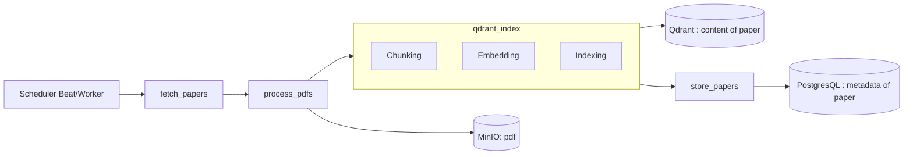
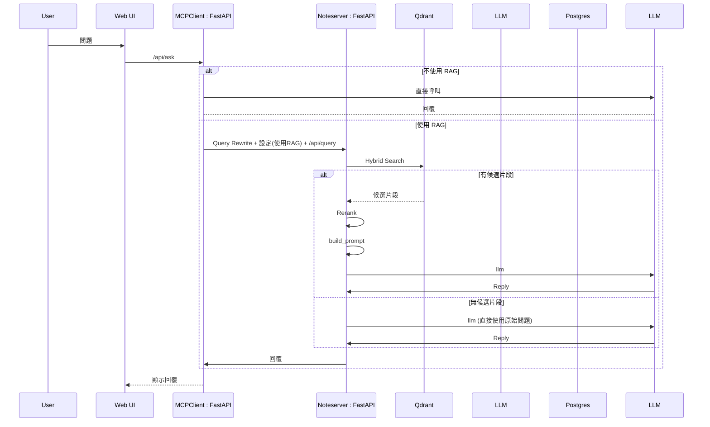
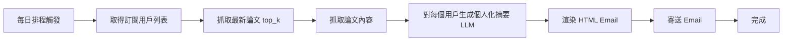

# 技術說明書：arXiv 驅動個人化 RAG 平台（含 Agentic RAG 與訂閱摘要）

> 版本：v0.1（草案）｜撰寫日期：2025-08-25｜目標讀者：後端、前端、MLOps、DevOps

---

## 1. 系統總覽

本系統由四大核心模組組成：

1. **arXiv Ingestion Pipeline**

   * 每日抓取最新論文 metadata 與 PDF，存入 PostgreSQL + MinIO + Qdrant。

2. **RAG Chat Engine（Agentic RAG）**

   * 查詢使用者問題 → Query Rewrite → 向量檢索 → Reranker → Prompt 組裝 → LLM 回覆。

3. **訂閱摘要 Email Service**

   * 對訂閱使用者，每日由 LLM 生成個人化摘要並透過 HTML Email 發送。

---

## 2. 系統架構

### 2.1 高階架構

```
[Web/SPA Frontend]
   │
   ▼
[API Gateway (FastAPI)]
   │
   ├─ Auth Service (OAuth/JWT)
   ├─ Papers Ingestion (CRUD/Search)
   ├─ Notes Service as RAG Service (Retriever + Reranker + LLM)
   └─ Subscription/Email Service
   │
   ├─ PostgreSQL (metadata, chats, users, jobs)
   ├─ MinIO (PDF / text artifacts)
   ├─ Qdrant (vectors: arxiv_global, user_notes_*)
   ├─ Redis (queue/cache)
   └─ Celery + Beat / Prefect (ingest & email schedules)
```

### 2.2 Mermaid 流程圖

#### a) 每日 arXiv Ingest



#### b) RAG Chat（Agentic）



#### c) 訂閱 Email



---

## 3. 技術選型

| 模組                     | 技術/工具                                                    | 備註                          |
| ---------------------- | -------------------------------------------------------- | --------------------------- |
| Web 前端                 | React / Next.js, shadcn/ui, Tailwind, Framer Motion      | SPA, 高互動                    |
| API / 後端               | FastAPI, Pydantic v2, SQLAlchemy, Alembic                | REST / GraphQL 可擴充          |
| 認證與授權                  | OAuth (Google), JWT, RBAC                                |  Token + refresh         |
| Ingestion / Task Queue | Celery + Redis + Beat 或 Prefect                          | 支援重試、冪等                     |
| 儲存                     | PostgreSQL (paper/users/user_setting), MinIO (PDF/Text) | S3 相容                       |
| 向量資料庫                  | Qdrant                |  Payload filter, Top-K |
| 檢索與 RAG                | LangChain / LlamaIndex, Hybrid Search                    | 向量+關鍵詞，reranker 可選          |
| Email                  | fastapi-email                                   | HTML  |
| 可觀測性                   | Prometheus / Grafana, OpenTelemetry, Langfuse            | Metrics / Tracing / LLM 事件  |


---

## 4. 資料模型概述

### 4.1 PostgreSQL 主表

* `users`,
* `papers`,
* `notes`,
* `user_setting`

### 4.2 Qdrant Collection

* payload: `{arxiv_id, abstract, title, authors, categories, published_date, text, chunk_id}`


### 4.3 MinIO 結構

* `{bucket_name}/{arxiv_id}/{arxiv_id}.pdf`
* `{bucket_name}/{arxiv_id}/*.img`

---

## 5. API 設計概覽

- MCPClient (token)
GET `/api/dashboard/stats`
POST `/api/ask`
POST, GET `/api/user/settings`

- note
GET `/api/user_notes/{user_id}`
POST `/api/query`
POST, GET  `/api/setting`
GET `/api/user/{user_id}`
---

## 6. 排程與任務設計

* **Ingest**：Celery Beat / Prefect， 完成 < 1 小時，支持重試 3 次。
* **Email**：每日固定時間觸發，異步生成 HTML Email。
* **Chat RAG**：即時向量檢索 + LLM 生成，問答步驟可配置。

---

## 7. 可觀測性與營運

* Metrics：Ingest 成功率、延遲、去重率；Chat 查詢延遲、Top-K 命中率、引用覆蓋率；Email 。
* Tracing：每次 RAG 問答步驟、LLM 調用、反思輪數。
* Alert/Log：任務失敗、Qdrant 不可用、MinIO 空間、Email 配額。

---
