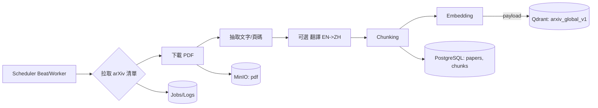
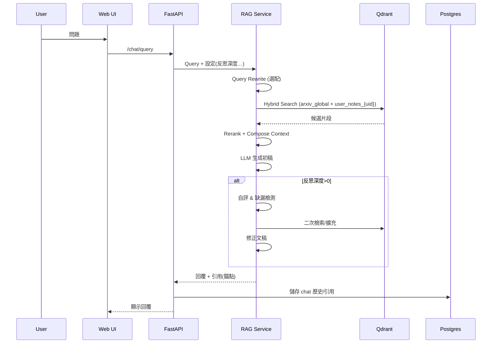
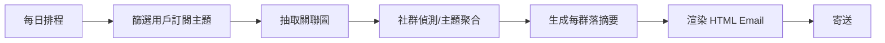

好的，我幫你把這份新版需求說明書整理成一份 **技術說明書（Technical Design Document, TDD）**，重點放在 **架構設計、技術選型、流程與資料流**，讓開發與 MLOps 團隊可以直接參考實作。

---

# 技術說明書：arXiv 驅動個人化 RAG 平台（含 Agentic RAG 與訂閱摘要）

> 版本：v0.1（草案）｜撰寫日期：2025-08-20｜目標讀者：後端、前端、MLOps、DevOps

---

## 1. 系統總覽

本系統由四大核心模組組成：

1. **arXiv Ingestion Pipeline**

   * 每日抓取最新論文 metadata 與 PDF，存入 PostgreSQL + MinIO + Qdrant。
   * 支援增量抓取、去重、Chunking 與 Embedding。

2. **RAG Chat Engine（Agentic RAG）**

   * 查詢使用者問題 → Query Rewrite → 向量 + BM25 檢索 → Reranker → LLM 生成初稿 → 反思/二次檢索 → 回覆 + 引用來源。

3. **個人筆記模組**

   * 支援 Markdown、PDF 上傳與 Chunk，與使用者向量資料庫隔離。

4. **GraphRAG 訂閱摘要與 Email Service**

   * 使用者訂閱主題 → 每日生成 GraphRAG 聚合摘要 → 寄送 HTML Email → 記錄開信、點擊、退信事件。

---

## 2. 系統架構

### 2.1 高階架構

```
[Web/SPA Frontend]
   │
   ▼
[API Gateway (FastAPI)]
   │
   ├─ Auth Service (OAuth/JWT)
   ├─ Papers Service (CRUD/Search)
   ├─ Notes Service
   ├─ RAG Service (Retriever + Reranker + LLM)
   └─ Subscription/Email Service
   │
   ├─ PostgreSQL (metadata, chats, users, jobs)
   ├─ MinIO (PDF / text artifacts)
   ├─ Qdrant (vectors: arxiv_global, user_notes_*)
   ├─ Redis (queue/cache)
   └─ Celery + Beat / Prefect (ingest & email schedules)
```

### 2.2 Mermaid 流程圖

#### a) 每日 arXiv Ingest



#### b) RAG Chat（Agentic）



#### c) 訂閱 Email（GraphRAG）



---

## 3. 技術選型

| 模組                     | 技術/工具                                                    | 備註                          |
| ---------------------- | -------------------------------------------------------- | --------------------------- |
| Web 前端                 | React / Next.js, shadcn/ui, Tailwind, Framer Motion      | SPA, 高互動                    |
| API / 後端               | FastAPI, Pydantic v2, SQLAlchemy, Alembic                | REST / GraphQL 可擴充          |
| 認證與授權                  | OAuth (Google), JWT, RBAC                                | 短存活 Token + refresh         |
| Ingestion / Task Queue | Celery + Redis + Beat 或 Prefect                          | 支援重試、冪等                     |
| 儲存                     | PostgreSQL (metadata/chats/users/jobs), MinIO (PDF/Text) | S3 相容                       |
| 向量資料庫                  | Qdrant (arxiv\_global, user\_notes\_\*)                  | HNSW, Payload filter, Top-K |
| 檢索與 RAG                | LangChain / LlamaIndex, Hybrid Search                    | 向量+關鍵詞，reranker 可選          |
| GraphRAG               | NER + Relation Extraction + NetworkX/Neo4j               | 用於 Email 聚合摘要               |
| Email                  | SendGrid / Postmark                                      | HTML Template, CTA, 開信/點擊追蹤 |
| 可觀測性                   | Prometheus / Grafana, OpenTelemetry, Langfuse            | Metrics / Tracing / LLM 事件  |

---

## 4. 資料隔離策略

* **arXiv 全局庫**：共用 `arxiv_global_v1` collection（只讀）。
* **個人筆記**：

  * 選項A：每使用者單獨 collection（`user_{uid}_notes_v1`）
  * 選項B：單 collection + `user_id` filter（維運簡化）
* PostgreSQL：所有筆記與聊天必帶 `user_id` 外鍵與索引，支援 GDPR 刪除。

---

## 5. 資料模型概述

### 5.1 PostgreSQL 主表

* `users`, `profiles`, `subscriptions`
* `papers`, `paper_chunks`
* `notes`, `note_chunks`
* `chat_sessions`, `chat_messages`, `citations`
* `jobs`, `email_batches`, `email_events`

### 5.2 Qdrant Collection

* `arxiv_global_v1`

  * payload: `{paper_id, chunk_id, page, section, lang, hash}`
* `user_{uid}_notes_v1`

  * payload: `{user_id, note_id, chunk_id, lang}`

### 5.3 MinIO 結構

* `arxiv/{yyyy}/{mm}/{arxiv_id}.pdf`
* `artifacts/{paper_id}/text.txt`（選配）

---

## 6. API 設計概覽

* `/auth/login` (OAuth callback)
* `/papers/search` & `/papers/{paper_id}`
* `/chat/sessions`, `/chat/query`
* `/notes` CRUD
* `/subscriptions` CRUD
* `/settings` (翻譯/Prompt/Agent 反思深度/檢索參數)
* Admin: `/ingest/run`, `/ingest/jobs`, `/index/rebuild`

---

## 7. 排程與任務設計

* **Ingest**：Celery Beat / Prefect，P95 完成 < 1 小時，支持重試 3 次。
* **Email**：每日固定時間觸發，異步生成 GraphRAG 聚合與 HTML Email。
* **Chat RAG**：即時向量檢索 + LLM 生成，多步反思可配置。

---

## 8. 可觀測性與營運

* Metrics：Ingest 成功率、延遲、去重率；Chat 查詢延遲、Top-K 命中率、引用覆蓋率；Email 開信/點擊/退信。
* Tracing：每次 RAG 問答步驟、LLM 調用、反思輪數。
* Alert/Log：任務失敗、Qdrant 不可用、MinIO 空間、Email 配額。

---

## 9. MVP & 里程規劃

| Phase | 功能/目標                                              |
| ----- | -------------------------------------------------- |
| 1     | arXiv 拉取 + PDF 下載 + 抽取 + Chunk + Embedding + 資料庫結構 |
| 2     | Chat RAG + 引用顯示 + 高級設定                             |
| 3     | GraphRAG 訂閱 Email                                  |
| 4     | 個人筆記 CRUD + Chat 整合                                |
| 5     | Admin & 可觀測化 (Prometheus/Grafana/OTel/Langfuse)    |

---

## 10. 風險與緩解

* PDF 解析：多引擎備援，保留頁碼/段落錨點
* Embedding 成本：批次、去重、向量壓縮
* GraphRAG 成效：節點規模控制，異步生成
* 多租戶資料洩露：payload filter、RLS、測試覆蓋

---

這份技術說明書可作為 **後端實作、MLOps 排程配置、前端 API 開發** 與 **資料庫設計** 的基礎依據，並可依 MVP 階段逐步落實。

---

我可以幫你下一步畫 **完整部署架構圖（Docker Compose + Service Layer + Queue + Vector DB + MinIO + Email Flow）**，這樣 DevOps 團隊可以直接照圖實作。

你希望我現在畫這個部署架構圖嗎？
