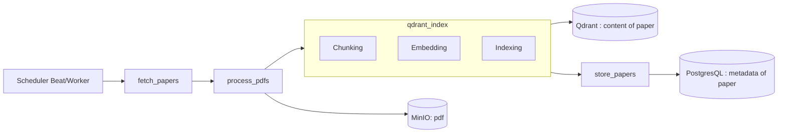
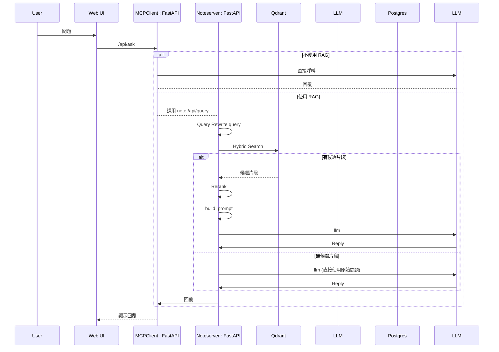
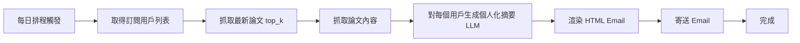

# 技術說明書：arXiv 驅動個人化 RAG 平台（含 Agentic RAG 與訂閱摘要）

> 版本：v0.2（更新）｜撰寫日期：2025-09-05｜目標讀者：後端、前端、MLOps、DevOps
---

## 1. 系統總覽

本系統由三大核心模組組成：

1. **arXiv Ingestion Pipeline**

   * 每日抓取最新論文 metadata 與 PDF，存入 PostgreSQL + MinIO + Qdrant。
   * 背景任務由 Celery / Prefect 調度。

2. **RAG Chat Engine（Agentic RAG）**

   * 查詢使用者問題 → Query Rewrite → 向量檢索 → Reranker → Prompt 組裝 → LLM 回覆。
   * 即時服務，前端透過 API Gateway 認證與限流後呼叫 Notes Service。

3. **訂閱摘要 Email Service**

   * 每日生成個人化摘要 Email，基於使用者設定與 Notes Service 結果。
   * 由背景任務定時觸發，不經前端直接呼叫，使用 Celery / Prefect 執行。

---

## 2. 系統架構

### 2.1 高階架構

```
[Web Frontend]
         │
         ▼
[API Gateway: Auth & Middleware]
         │
         ▼
      [Notes Service (RAG)]
         │
         └─ Uses shared storage:
               ├─ PostgreSQL
               ├─ MinIO
               ├─ Qdrant
               └─ Redis (queue/cache)

[Background Tasks]
 ├─ Papers Ingestion Service (scheduled)
 │     └─ Writes/Reads shared storage
 └─ Subscription/Email Service (scheduled)
       └─ Reads shared storage
       └─ Calls Notes Service for personalized content

```
說明：
- API Gateway：唯一對外入口，負責 OAuth/JWT 認證、限流、共用 middleware，前端查詢需通過它。
- Notes Service：提供 RAG 問答功能，Gateway 直接與其互動。
- Background Tasks：定時抓取論文或生成 Email，直接操作共享儲存，部分會調用 Notes Service。

### 2.2 Mermaid 流程圖

#### a) 每日 arXiv Ingest


```mermaid
flowchart LR

  M[(MinIO: pdf)]
  P[(PostgresQL : metadata of paper)]
  Q[(Qdrant : content of paper)]


  S[Scheduler Beat/Worker] --> A[fetch_papers]
  A --> B[process_pdfs]

  B --> C[qdrant_index]

  subgraph C[qdrant_index]
    C1[Chunking]
    C2[Embedding]
    C3[Indexing]
  end

  C --> D[store_papers]

  B --> M
  C --> Q
  D --> P
```

#### b) RAG Chat（Agentic）


```mermaid
sequenceDiagram
  participant U as User
  participant FE as Web UI
  participant API as MCPClient : FastAPI
  participant R as Noteserver : FastAPI
  participant Q as Qdrant
  participant L as LLM
  participant DB as Postgres
  U->>FE: 問題
  FE->>API: /api/ask
  alt 不使用 RAG
    API->>LLM: 直接呼叫
    LLM-->API: 回覆
  else 使用 RAG
    API --> R: 調用 note /api/query
    R->>R:  Query Rewrite query
    R->>Q: Hybrid Search
    alt 有候選片段
      Q-->>R: 候選片段
      R->>R: Rerank
      R->>R: build_prompt
      R->>LLM: llm
      LLM->>R: Reply
    else 無候選片段
      R->>LLM: llm (直接使用原始問題)
      LLM->>R: Reply
    end
    R->>API: 回覆
  end
  API-->>FE: 顯示回覆
```

#### c) 訂閱 Email


```mermaid
flowchart LR
  S[每日排程觸發] --> F[取得訂閱用戶列表]
  F --> P[抓取最新論文 top_k ]
  P --> C[抓取論文內容]
  C --> R[對每個用戶生成個人化摘要 LLM]
  R --> E[渲染 HTML Email]
  E --> M[寄送 Email]
  M --> L[完成]
```

---

## 3. 技術選型

| 模組                     | 技術/工具                                                    | 備註                          |
| ---------------------- | -------------------------------------------------------- | --------------------------- |
| Web 前端                 | React, Typescriptjs, Vite                                         | SPA, 高互動                    |
| API / 後端               | FastAPI, Pydantic, SQLAlchemy, Prefect                | REST / GraphQL 可擴充          |
| 認證與授權                  | OAuth (Google), JWT, RBAC                                |  Token + refresh         |
| Task Queue | Celery + Redis + Beat                          |     |
| 儲存                     | PostgreSQL , MinIO, Qdrant  | S3 相容,  Payload filter, Top-K                     |
| 檢索與 RAG                | LangChain / LlamaIndex, Hybrid Search                    | 向量+關鍵詞，reranker 可選          |
| 可觀測性                   | Prometheus / Grafana, OpenTelemetry, Langfuse            | Metrics / Tracing / LLM 事件  |


---

## 4. 資料模型概述

### 4.1 PostgreSQL 主表

* `users`,
* `papers`,
* `notes`,
* `user_setting`

### 4.2 Qdrant Collection

* payload: `{arxiv_id, abstract, title, authors, categories, published_date, text, chunk_id}`


### 4.3 MinIO 結構

* `{bucket_name}/{arxiv_id}/{arxiv_id}.pdf`
* `{bucket_name}/{arxiv_id}/*.img`

---

## 5. API 設計概覽

MCPClient (token)
- GET `/api/dashboard/stats`
- POST `/api/ask`
- POST, GET `/api/user/settings`
- GET `/api/chat/history`

note
- GET `/api/user/{user_id}`
- POST `/api/query`
- POST, GET  `/api/setting`
- GET `/api/chat/history`
---

## 6. 排程與任務設計

* **Ingest**：Celery Beat / Prefect。
* **Email**：每日固定時間觸發，異步生成 HTML Email。
* **Chat RAG**：即時向量檢索 + LLM 生成，問答步驟可配置。

---

## 7. 可觀測性與營運

* Metrics：Celery 任務、API 路由、Redis/DB 操作、LLM 調用的成功率、延遲與錯誤率。
* Tracing：RAG 問答流程與背景任務（Ingest / Email / Notes Service）全程追蹤。
* Alert / Log：服務可用性、API 過頻、資源異常（CPU/Memory/Disk）、Redis/DB 錯誤。

> :100:監控由 Prometheus / Grafana 收集，AlertManager 發送通知，並結合 Instrumentator / decorator 進行程式內 Metrics 收集
---
