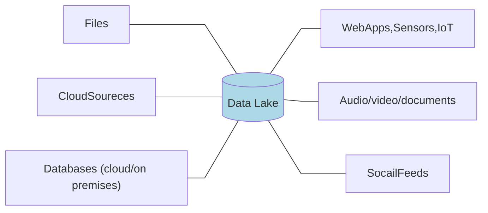
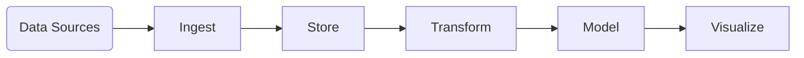
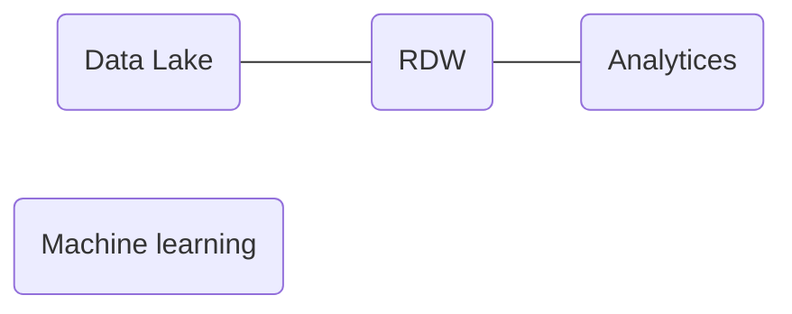
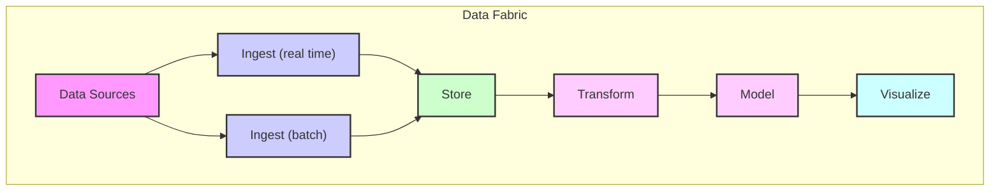
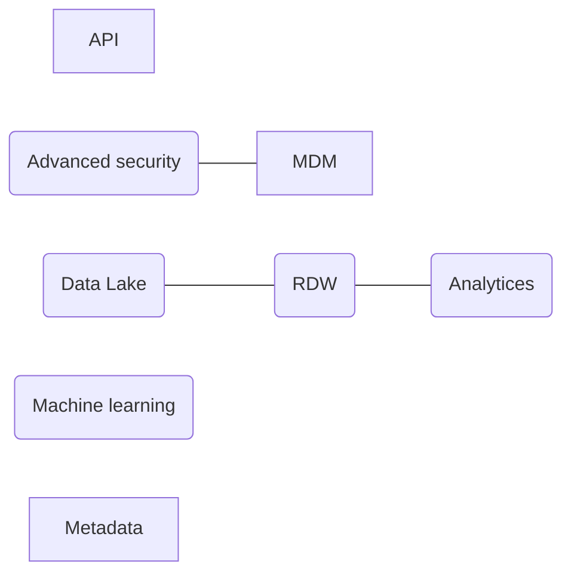

# Chapter 2:Types of Data Architectures


[:house:目錄](/8G7wHhrjTwqilLbCvByazQ) 
[:link: Reference link](https://www.oreilly.com/library/view/deciphering-data-architectures/9781098150754/ch02.html)

---
Data architecture refers to the overall design and organization of data within an information system.

## Evolution of Data Architectures
- schema-on-write : predefined schema
    - Relational database 
    - Schema refers to the formal structure that defines the organization of—and relationships between—tables, fields, data types, and constraints.
- schema-on-read : the schema is applied when data is read or accessed, rather than when it is written.
    - This approach offers more flexibility in storing unstructured or semi-structured data, and it is commonly used in **data lakes**


While data architectures can take many different forms, some common elements include
- Data storage
- Data Processing
- Data access
- Data security and privacy
- Data governance

Comparison of data architectures
| **Characteristic**           | **Relational Data Warehouse** | **Data Lake**            | **Modern Data Warehouse**  | **Data Fabric**           | **Data Lakehouse**        | **Data Mesh**             |
|------------------------------|-------------------------------|--------------------------|----------------------------|---------------------------|---------------------------|---------------------------|
| **Year Introduced**           | 1984                          | 2010                     | 2011                       | 2016                      | 2020                      | 2019                      |
| **Centralized/Decentralized** | Centralized                   | Centralized              | Centralized                | Centralized               | Centralized               | Decentralized             |
| **Storage Type**              | Relational                    | Object                   | Relational and Object      | Relational and Object     | Object                    | Domain-specific           |
| **Schema Type**               | Schema-on-write               | Schema-on-read           | Schema-on-read and write   | Schema-on-read and write  | Schema-on-read            | Domain-specific           |
| **Data Security**             | High                          | Low to Medium            | Medium to High             | High                      | Medium                    | Domain-specific           |
| **Data Latency**              | Low                           | High                     | Low to High                | Low to High               | Medium to High            | Domain-specific           |
| **Time to Value**             | Medium                        | Low                      | Low                        | Low                       | Low                       | High                      |
| **Total Cost of Solution**    | High                          | Low                      | Medium                     | Medium to High            | Low to Medium             | High                      |
| **Supported Use Cases**       | Low                           | Low to Medium            | Medium                     | Medium to High            | High                      | High                      |
| **Difficulty of Development** | Low                           | Medium                   | Medium                     | Medium                    | Medium to High            | High                      |
| **Maturity of Technology**    | High                          | Medium                   | Medium to High             | Medium to High            | Medium to High            | Low                       |
| **Company Skill Set Needed**  | Low                           | Low to Medium            | Medium                     | Medium to High            | Medium to High            | High                      |


## Relational of Data Warehouse
A relational data warehouse (RDW) is a specific type of relational database that is designed for data warehousing and business intelligence applications, with optimized query performance and support for large-scale data analysis. While both relational data warehouses and transactional process‐ing use the relational model to organize data, a relational data warehouse is typically larger in scale and is optimized for analytical queries.

RDWs have both a compute engine and storage. The compute engine is the processing power used to query the data. The storage is relational storage, which holds data that is structured via tables, rows, and columns. The RDW’s compute power can be used only on its relational storage—they are tied together.

 ```mermaid
 %%{init: { "flowchart": {"curve": "linear" } } }%%

flowchart LR;
    CRM --- DataWarehouse[("Data warehouse")];
    Inventory --- DataWarehouse[("Data warehouse")];
    Sales --- DataWarehouse[("Data warehouse")];
    DataWarehouse[("Data warehouse")] --- Customer["Customer profitability"];
    DataWarehouse[("Data warehouse")] --- Productivity;
    DataWarehouse[("Data warehouse")] --- Product["Product profitability"];

    classDef center fill:lightblue;
    class DataWarehouse center;
```

You can run queries and generate reports on a relational database that’s in use by an operational application, but doing so uses **a lot of resources** and can conflict with other CRUD operations running at the same time. That can slow everything down

RDWs were invented in part to solve this problem. **The data from the relational database is copied into a data warehouse**, and users can run queries and reports against the data warehouse instead of the relational database. This way, they’re not taxing the system that houses the relational database and slowing the application for end users.


        
## Data Lake
A data lake is simply storage—unlike a relational data warehouse, there is **no compute engine** associated with it. Fortunately, there are many compute engines that can work with data lakes, so compute power is usually cheaper for a data lake than for a relational data warehouse. Another difference is that while RDWs use relational storage, data lakes use **object storage**, which does not need the data to be structured into rows and columns.

In contrast to a relational data warehouse, **a data lake is schema-on-read**, meaning that no up-front work is needed to put data in the data lake: it can be as simple as copying files into it.


These files could hold data that is structured (like data from relational databases), semi-structured (like CSV, logs, XML, or JSON files), or unstructured (such as from emails, documents, and PDFs). They can even hold binary data (like images, audio, and video)


Data lakes started out as the solution to all the problems with relational data warehouses, including high cost, limited scalability, poor performance, data preparation overhead, and limited support for complex data types. 


The problem was that querying data lakes isn’t actually that easy: it requires some fairly advanced skill sets. In addition, data lakes did not have some of the features people liked about data warehouses, like transaction support, schema enforcement, and audit trails.

But the data lake did not go away. Instead, its purpose morphed into a different, but
very useful, one: staging and preparing dat

## Modern Data Warehouse

Relational data warehouses and data lakes, on their own, are simplistic architectures. They use only one technology to centralize the data, with few to no supporting products. When you use more technologies and products to support relational data warehouses or data lakes, they evolve into the architectures discussed in this and the following chapters. Data lakes failed to replace relational data warehouses but still offered benefits for staging and preparing data. Why not have the advantages of both? Around 2011, many companies started building architectures that place data lakes side by side with relational data warehouses to form the data architecture we now call the modern data warehouse (MDW)




> * Data Lake 包含了 Store, Transform, = Machine learning
> * EDW 包含了 Model
> * Analytices 包含了 Visualize


It’s a “best of both worlds” approach: the data lake is for staging and preparing data(Store, Transform), and data scientists use it to build machine learning models; the data warehouse is for serving, security, and compliance, and business users do their querying and reporting with it. 

## Data Fabric



> * API 包含了 Transform, Model, Visualize
> * Advanced security 包含了 Store
> * MDM 包含了 Transform
> * Data Lake 包含了 Store, Transform
> * EDW 包含了 Model
> * Analytices 包含了 Visualize
> * Machine learning 包含了 Store, Transform
> * Metadata 包含了 Store, Transform, Model, Visualize

You could think of the data fabric architecture as an evolution of the modern data warehouse architecture, with more technology added to source more data, secure it, and make it available. Also, improvements have been made to how the system ingests data, transforms, queries, searches, and access data.

With all those additions, the system becomes a “fabric”—a large framework that can ingest any sort of data

## Data Lakehouse
The term data lakehouse is a portmanteau (blend) of data lake and data warehouse. Data lakehouse architectures became popular around 2020, when the company Databricks started using the term.The concept of a lakehouse is to get rid of the relational data warehouse and use just one repository, a data lake, in your data architecture. All types of data—structured, semi-structured, and unstructured—are ingested into the data lake, and all queries and reports are done from the data lake

A transactional storage software layer that runs on top of an existing data lake and makes it work more like a relational database. 


## Data Mesh
There is a lot to like about data mesh architecture, but despite the hype, it is only a fit for a small number of use cases.


The modern data warehouse, data fabric, and data lakehouse architectures all involve centralizing data: copying operational data into a central location owned by IT under an architecture that IT controls, where IT then creates analytical data 


This centralized approach brings three main challenges: data **ownership**, data **quality**, and organizational/technical **scaling**. The aim of the data mesh is to solve these challenges.


In a data mesh, data is kept within several domains within a company, such as manufacturing, sales, and suppliers. Each domain has its own mini IT team that owns its data, cleans it, creates the analytical data, and makes it available. Each domain also has its own compute and storage infrastructure. This results in a decentralized architecture where data, people, and infrastructure are scaled out—the more domains you have, the more people and infrastructure you get. The system can handle more data, and IT is no longer a bottleneck


Implementing data mesh involves a very big organizational and cultural shift that very few companies are ready for. (Indeed, most companies aren’t even large enough to be considered for a data mesh architecture: this is very much an enterprise approach.) Building it requires determining which pieces of existing technology you can repurpose for it and which pieces you will have to create. Each domain gets to determine what technologies it will use to build out its part of the data mesh, which could include building a modern data warehouse, data fabric, or data lakehouse.