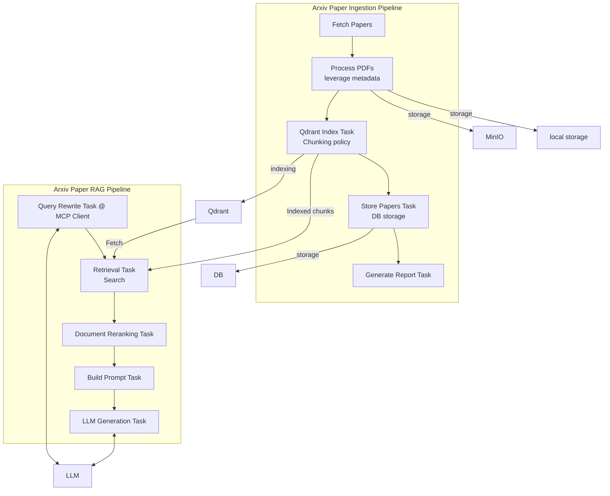

```
arxiv_ingestion/
├── arxiv_pipeline.py          # Main pipeline for fetching, processing, and storing ArXiv papers
├── arxiv_rag_pipeline.py      # RAG pipeline for retrieval-augmented generation using LLM
├── config.py                  # Configuration settings (e.g., API URLs, collection names)
├── db/
│   ├── factory.py             # Database session/factory creation
│   ├── minio.py               # MinIO client setup for PDF storage
│   ├── models.py              # ORM models for database entities (Paper, User, etc.)
│   └── qdrant.py              # Qdrant client setup and utilities for vector DB
├── exceptions.py              # Custom exception classes
├── flows/
│   └── daily_flow.py          # Prefect daily scheduled flow orchestration
├── readme.md                  # Project overview and instructions
├── services/
│   ├── arxiv_client.py        # Client for querying ArXiv API
│   ├── embedding.py           # Embedding functions for text to vector
│   ├── metadata_fetcher.py    # Extracting metadata from ArXiv papers
│   ├── pdf_parser.py          # Parsing PDFs to extract text or sections
│   └── schemas.py             # Pydantic schemas / data models
└── tasks/
    ├── fetch_papers.py        # Prefect task to fetch papers from ArXiv
    ├── generate_report.py     # Task to generate summary reports
    ├── llm.py                 # Task for calling LLM (Ollama) for text generation
    ├── process_pdfs.py        # Task to parse PDFs and extract content
    ├── prompt.py              # Task to build prompts for LLM
    ├── qdrant_index.py        # Task to index paper chunks into Qdrant
    ├── rerank.py              # Task to rerank retrieved chunks (vector + text)
    ├── retrieval.py           # Task to retrieve relevant chunks from Qdrant
    └── store_papers.py        # Task to store processed papers into DB

```

- 感謝 arXiv 提供其開放存取服務
- 每次請求間隔 ≥ 3 秒，僅一連線
- 每分鐘最多 1 個 request


